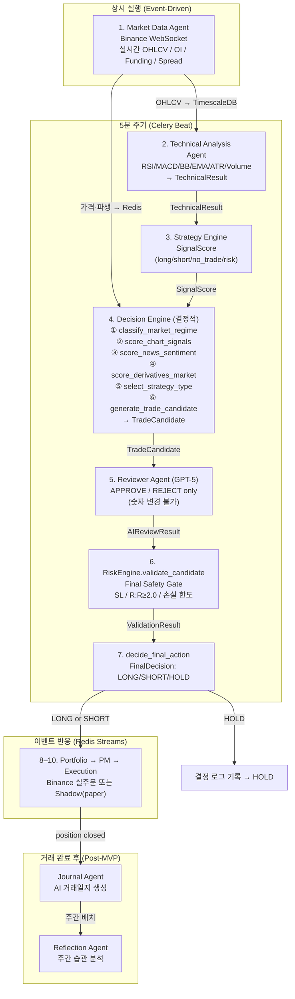
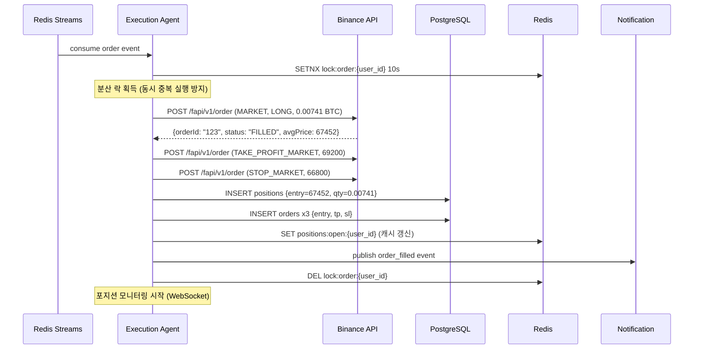
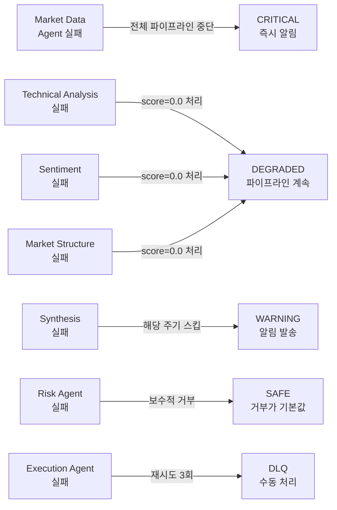

# AI Trading Copilot — Agent Design Document

> 작성일: 2026-06-04
> 버전: v2.0 (2026-06-12 업데이트: Steps 1–17 결정적 파이프라인 반영)
> 참조: CLAUDE.md, ARCHITECTURE.md, DATABASE.md, PRD.md, docs/DECISION_FLOW.md

---

## 목차

0. [전체 에이전트 파이프라인](#0-전체-에이전트-파이프라인)
1. [Market Data Agent](#1-market-data-agent)
2. [Technical Analysis Agent](#2-technical-analysis-agent)
3. [Sentiment Agent](#3-sentiment-agent)
4. [Market Structure Agent](#4-market-structure-agent)
5. [Reviewer Agent (GPT-5)](#5-reviewer-agent-gpt-5)
6. [Risk Agent](#6-risk-agent)
7. [Execution Agent](#7-execution-agent)
8. [Journal Agent](#8-journal-agent)
9. [Reflection Agent](#9-reflection-agent)
10. [LangGraph State 설계](#10-langgraph-state-설계)
11. [에러 처리 전략](#11-에러-처리-전략)

---

## 0. 전체 에이전트 파이프라인

> **현행 파이프라인 (2026-06-12):** 결정적 DecisionEngine이 TradeCandidate를 생성하고, GPT-5 ReviewerAgent가 APPROVE/REJECT 검토만 수행한다. AI는 진입가·손절가·목표가·레버리지를 생성하거나 변경하지 않는다.

### 0.1 시스템 전체 흐름



### 0.2 에이전트 요약 테이블

| # | Component | 실행 방식 | 주기 | LLM 사용 | 역할 |
|---|---|---|---|---|---|
| 1 | Market Data Agent | 상시 (WebSocket) | 실시간 | ✗ | OHLCV / OI / Funding 수집 |
| 2 | Technical Analysis Agent | 주기적 (Celery) | 5분 | ✗ | 기술 지표 계산 → TechnicalResult |
| 3 | Strategy Engine | 주기적 | 5분 | ✗ | SignalScore 생성 |
| 4 | **DecisionEngine** | 주기적 | 5분 | ✗ | **TradeCandidate 결정적 생성** |
| 5 | **ReviewerAgent** | 주기적 | 5분 | ✅ GPT-5 | **APPROVE / REJECT 검토 전용** |
| 6 | **RiskEngine** | 이벤트 | 즉시 | ✗ | **최종 안전 게이트** |
| 7 | FinalDecision | 이벤트 | 즉시 | ✗ | LONG / SHORT / HOLD 결정 |
| 8 | Portfolio / PM / Execution | 이벤트 | 즉시 | ✗ | 실주문 또는 Shadow 기록 |
| — | Journal Agent | 이벤트 | 즉시 | ✅ | AI 거래일지 (Post-MVP) |
| — | Reflection Agent | 배치 | 주 1회 | ✅ | 주간 분석 (Post-MVP) |
| — | ~~AnalystAgent~~ | **DEPRECATED** | — | ~~GPT~~ | 구 경로. 프로덕션 미사용. |

> **AnalystAgent (`agents/analyst/`):** AI가 직접 시그널을 생성하던 구 경로. `agents/decision/` + `agents/synthesis/`로 대체됨. `OpenAIClient`만 `ReviewerAgent`가 재사용 중이며 향후 이전 예정.

상세 구현 및 FinalDecision 조건은 [`docs/DECISION_FLOW.md`](docs/DECISION_FLOW.md) 참조.

---

## 1. Market Data Agent

### 1.1 역할

Binance WebSocket에 상시 연결하여 실시간 시장 데이터를 수집한다.
수집된 데이터를 TimescaleDB(영구 저장)와 Redis(실시간 캐시)에 이중 저장하며,
새 캔들 완성(candle close) 이벤트를 분석 파이프라인에 발행한다.

이 에이전트는 시스템의 데이터 소스다. 이것이 멈추면 모든 분석이 멈춘다.

### 1.2 입력

| 소스 | 스트림 | 데이터 |
|------|-------|-------|
| Binance WebSocket | `wss://fstream.binance.com/stream` | OHLCV Kline (1m, 5m, 15m, 1h, 4h, 1d) |
| Binance WebSocket | `<symbol>@aggTrade` | 실시간 체결 데이터 |
| Binance WebSocket | `<symbol>@depth` | 호가창 (Top 5) |
| Binance REST API | `/fapi/v1/premiumIndex` | Funding Rate |
| Binance REST API | `/fapi/v1/openInterest` | Open Interest |

```json
// Binance Kline WebSocket 원본 이벤트
{
  "e": "kline",
  "E": 1717459800000,
  "s": "BTCUSDT",
  "k": {
    "t": 1717459800000,
    "T": 1717460099999,
    "s": "BTCUSDT",
    "i": "5m",
    "o": "67450.00",
    "c": "67520.00",
    "h": "67580.00",
    "l": "67400.00",
    "v": "123.456",
    "x": true
  }
}
```

### 1.3 출력

**TimescaleDB 저장:**
```sql
INSERT INTO ohlcv (time, coin, interval, open, high, low, close, volume)
VALUES ('2026-06-04 09:35:00+00', 'BTC', '5m', 67450, 67580, 67400, 67520, 123.456);
```

**Redis 캐시 (TTL: 1초):**
```json
// key: price:BTC
{
  "coin": "BTC",
  "symbol": "BTCUSDT",
  "price": 67520.00,
  "updated_at": "2026-06-04T09:35:05Z"
}
```

**Redis Streams (캔들 완성 시):**
```json
// stream: stream:analysis_trigger
{
  "event": "candle_closed",
  "coin": "BTC",
  "symbol": "BTCUSDT",
  "interval": "5m",
  "close_price": 67520.00,
  "close_time": "2026-06-04T09:35:00Z"
}
```

### 1.4 실행 주기

```
실행 방식: 상시 실행 (asyncio event loop)
연결 관리: websockets 라이브러리, Ping/Pong 자동 처리
재연결:    지수 백오프 (1s → 2s → 4s → 8s → max 30s)
헬스체크:  30초마다 마지막 수신 시간 확인
```

### 1.5 실패 처리

```python
# 연결 끊김 → 자동 재연결 (지수 백오프)
# 재연결 성공 후 누락 데이터 REST API로 보충
async def recover_missing_candles(coin: str, interval: str, since: datetime):
    klines = await binance_client.get_klines(
        symbol=f"{coin}USDT",
        interval=interval,
        startTime=int(since.timestamp() * 1000),
    )
    await bulk_insert_ohlcv(klines)

# 5분 이상 데이터 수신 없음 → PagerDuty / Slack 알림
# TimescaleDB 쓰기 실패 → Redis에 임시 저장 후 재시도
```

### 1.6 예제 JSON

```json
// agent_decisions 저장 샘플
{
  "agent_name": "market_data",
  "agent_version": "1.0",
  "input_data": {
    "source": "binance_websocket",
    "symbol": "BTCUSDT",
    "interval": "5m"
  },
  "output_data": {
    "candles_stored": 1,
    "last_price": 67520.00,
    "funding_rate": -0.0002,
    "open_interest": 28451234567.0,
    "recovery_needed": false
  },
  "latency_ms": 3,
  "created_at": "2026-06-04T09:35:05Z"
}
```

---

## 2. Technical Analysis Agent

### 2.1 역할

TimescaleDB에 저장된 OHLCV 데이터를 기반으로 기술적 지표를 계산하고,
멀티 타임프레임 분석을 통해 기술적 방향성 점수(-1.0 ~ +1.0)를 산출한다.
LLM을 사용하지 않는 순수 수학 계산 에이전트다.

### 2.2 입력

| 필드 | 타입 | 설명 |
|------|------|------|
| coin | str | 분석 대상 코인 ('BTC', 'ETH') |
| symbol | str | 거래 심볼 ('BTCUSDT') |
| timeframes | list[str] | 분석 타임프레임 |
| ohlcv | dict[str, DataFrame] | 타임프레임별 OHLCV 데이터 |

```json
// 입력 데이터 구조
{
  "coin": "BTC",
  "symbol": "BTCUSDT",
  "timeframes": ["1m", "5m", "15m", "1h", "4h", "1d"],
  "lookback_candles": {
    "1m": 200,
    "5m": 200,
    "15m": 100,
    "1h": 100,
    "4h": 50,
    "1d": 30
  }
}
```

### 2.3 출력

| 필드 | 타입 | 설명 |
|------|------|------|
| tech_score | float | 종합 기술적 점수 (-1.0 ~ +1.0) |
| timeframe_scores | dict | 타임프레임별 점수 |
| indicators | dict | 핵심 지표 값 |
| signals_fired | list[str] | 발생한 시그널 목록 |
| support_levels | list[float] | 주요 지지선 |
| resistance_levels | list[float] | 주요 저항선 |

### 2.4 지표 계산 로직

```python
# agents/technical_analyst.py

INDICATOR_WEIGHTS = {
    "trend":    0.35,  # EMA 배열, MACD 방향
    "momentum": 0.30,  # RSI, Stochastic
    "volatility": 0.20, # Bollinger Bands, ATR
    "volume":   0.15,  # Volume, OBV
}

TIMEFRAME_WEIGHTS = {
    "1d":  0.30,
    "4h":  0.25,
    "1h":  0.20,
    "15m": 0.15,
    "5m":  0.07,
    "1m":  0.03,
}

def calculate_rsi_signal(rsi_value: float) -> float:
    """RSI 값을 -1.0 ~ +1.0 점수로 변환"""
    if rsi_value <= 20:   return +1.0   # 극단 과매도
    if rsi_value <= 30:   return +0.7   # 과매도
    if rsi_value <= 40:   return +0.3   # 약한 매수
    if rsi_value <= 60:   return  0.0   # 중립
    if rsi_value <= 70:   return -0.3   # 약한 매도
    if rsi_value <= 80:   return -0.7   # 과매수
    return -1.0                          # 극단 과매수

def detect_support_resistance(df: pd.DataFrame) -> tuple[list, list]:
    """피봇 포인트 기반 지지/저항선 감지"""
    pivots = df['high'].rolling(5, center=True).max()
    supports = df['low'].rolling(5, center=True).min()
    return supports.dropna().tail(3).tolist(), pivots.dropna().tail(3).tolist()
```

### 2.5 실행 주기

```
실행 방식: Celery Task (분석 파이프라인 첫 번째 단계)
실행 주기: 5분 (BTC), 5분 (ETH) — 병렬 실행
타임아웃:  10초 (초과 시 실패 처리)
```

### 2.6 실패 처리

```
- TimescaleDB 조회 실패 → Redis 캐시 데이터로 폴백 (최대 5분 이전 데이터)
- 데이터 부족 (캔들 수 < 50) → score = 0.0 (중립), 파이프라인 계속
- 지표 계산 오류 → 해당 지표만 스킵, 나머지로 점수 재계산
- 전체 실패 → Synthesis에 None 전달 → 해당 차원 가중치 제거
```

### 2.7 예제 JSON

```json
// agent_decisions.output_data
{
  "tech_score": 0.72,
  "timeframe_scores": {
    "1d": 0.80,
    "4h": 0.75,
    "1h": 0.65,
    "15m": 0.60,
    "5m": 0.55,
    "1m": 0.40
  },
  "indicators": {
    "rsi_1h": 42.3,
    "rsi_4h": 38.1,
    "macd_1h": {"macd": 125.4, "signal": 89.2, "histogram": 36.2, "cross": "bullish"},
    "bb_1h": {"upper": 68200, "middle": 67100, "lower": 66000, "position": "lower_half"},
    "ema_1h": {"ema9": 67480, "ema21": 67250, "ema50": 66800, "ema200": 64200, "alignment": "bullish"},
    "volume_1h": {"current": 1234.5, "ma20": 980.2, "ratio": 1.26, "signal": "above_average"},
    "atr_1h": 420.5
  },
  "signals_fired": [
    "rsi_oversold_4h",
    "ema200_support_1h",
    "volume_surge_1h",
    "macd_bullish_cross_1h",
    "bb_lower_band_touch_1h"
  ],
  "support_levels": [66800.0, 66200.0, 65500.0],
  "resistance_levels": [68200.0, 69000.0, 70000.0],
  "latest_close": 67450.0
}
```

---

## 3. Sentiment Agent

### 3.1 역할

뉴스 감성 분석과 시장 심리 지표를 통해 시장 감성 점수(-1.0 ~ +1.0)를 산출한다.
FinBERT 모델로 크립토 뉴스 헤드라인을 분류하고,
Fear & Greed Index를 수치화하여 종합 감성 점수를 생성한다.

### 3.2 입력

| 소스 | 데이터 | 갱신 주기 |
|------|-------|---------|
| CryptoCompare API | 최근 뉴스 헤드라인 20개 | 5분 |
| Alternative.me API | Fear & Greed Index | 1일 |
| Redis 캐시 | 이전 감성 점수 | 5분 |

```json
// 입력 데이터 구조
{
  "coin": "BTC",
  "news_count": 20,
  "news_lookback_hours": 4,
  "fear_greed_index": 42
}
```

### 3.3 출력

| 필드 | 타입 | 설명 |
|------|------|------|
| sentiment_score | float | 종합 감성 점수 (-1.0 ~ +1.0) |
| news_score | float | 뉴스 감성 점수 |
| fear_greed_score | float | F&G 정규화 점수 |
| news_items | list | 분류된 뉴스 목록 |
| dominant_sentiment | str | 'positive'/'negative'/'neutral' |

### 3.4 처리 로직

```python
# agents/sentiment_agent.py

from transformers import pipeline
finbert = pipeline("text-classification", model="ProsusAI/finbert")

def calculate_news_score(headlines: list[str]) -> float:
    """FinBERT로 헤드라인 감성 분류 후 가중 평균"""
    results = finbert(headlines, truncation=True, max_length=512)
    scores = []
    for r in results:
        if r['label'] == 'positive':   scores.append(+r['score'])
        elif r['label'] == 'negative': scores.append(-r['score'])
        else:                          scores.append(0.0)
    # 최근 뉴스에 더 높은 가중치
    weights = [1.0 / (i + 1) for i in range(len(scores))]
    return float(np.average(scores, weights=weights))

def normalize_fear_greed(index: int) -> float:
    """Fear & Greed Index (0-100) → -1.0 ~ +1.0"""
    # 0(극단 공포) = +1.0 (역발상), 100(극단 탐욕) = -1.0
    return (50 - index) / 50.0

WEIGHTS = {"news": 0.65, "fear_greed": 0.35}
```

### 3.5 실행 주기

```
실행 방식: Celery Task (Technical Analysis와 병렬 실행)
실행 주기: 5분
타임아웃:  15초 (FinBERT 추론 포함)
캐싱:     뉴스는 5분 캐시 (같은 주기 내 재사용), F&G는 1시간 캐시
```

### 3.6 실패 처리

```
- CryptoCompare API 실패 → 이전 캐시 점수 사용 (최대 30분)
- FinBERT 추론 실패 → 뉴스 점수 0.0 처리 (F&G만으로 계산)
- F&G API 실패 → F&G 가중치를 뉴스에 합산
- 뉴스 0건 → sentiment_score = 0.0 (중립)
```

### 3.7 예제 JSON

```json
// agent_decisions.output_data
{
  "sentiment_score": -0.31,
  "news_score": -0.42,
  "fear_greed_score": 0.16,
  "fear_greed_index": 42,
  "fear_greed_label": "Fear",
  "dominant_sentiment": "negative",
  "news_items": [
    {
      "headline": "Bitcoin ETF sees $200M outflows as macro fears persist",
      "source": "CoinDesk",
      "published_at": "2026-06-04T08:45:00Z",
      "sentiment": "negative",
      "confidence": 0.94,
      "score": -0.94
    },
    {
      "headline": "BTC on-chain metrics show accumulation by long-term holders",
      "source": "Glassnode",
      "published_at": "2026-06-04T07:30:00Z",
      "sentiment": "positive",
      "confidence": 0.82,
      "score": 0.82
    }
  ],
  "news_analyzed": 18,
  "cache_used": false
}
```

---

## 4. Market Structure Agent

### 4.1 역할

Binance Futures 시장 구조 데이터를 분석하여 기관/고래 포지션 방향과
시장 미시 구조의 점수(-1.0 ~ +1.0)를 산출한다.
가격 액션이 아닌 포지션 데이터로 시장 참여자의 심리를 파악한다.

### 4.2 입력

| 소스 | 엔드포인트 | 데이터 |
|------|----------|-------|
| Binance REST | `/fapi/v1/openInterest` | Open Interest |
| Binance REST | `/fapi/v1/premiumIndex` | Funding Rate |
| Binance REST | `/futures/data/globalLongShortAccountRatio` | Long/Short 비율 |
| Binance REST | `/futures/data/takerlongshortRatio` | Taker Buy/Sell 비율 |
| Binance REST | `/fapi/v1/aggTrades` | 대형 거래 감지 |
| TimescaleDB | OI 이력 | OI 변화율 계산용 |

```json
// 입력 데이터 구조
{
  "coin": "BTC",
  "symbol": "BTCUSDT",
  "oi_lookback_periods": 12,
  "whale_trade_threshold_usdt": 500000
}
```

### 4.3 출력

| 필드 | 타입 | 설명 |
|------|------|------|
| market_score | float | 종합 시장 구조 점수 (-1.0 ~ +1.0) |
| funding_rate | float | 현재 Funding Rate |
| oi_change_pct | float | OI 변화율 (%) |
| long_short_ratio | float | 롱/숏 비율 |
| whale_activity | str | 'accumulating'/'distributing'/'neutral' |
| market_regime | str | 'bullish_structure'/'bearish_structure'/'ranging' |

### 4.4 처리 로직

```python
# agents/market_structure.py

def score_funding_rate(rate: float) -> float:
    """Funding Rate → 점수 변환 (역발상 지표)"""
    # 극단적 양수 Funding = 롱 과다 = 숏 신호
    # 극단적 음수 Funding = 숏 과다 = 롱 신호
    if rate >= 0.003:   return -1.0   # 극단 롱 과다
    if rate >= 0.001:   return -0.6
    if rate >= 0.0001:  return -0.2
    if rate >= -0.0001: return  0.0   # 중립
    if rate >= -0.001:  return +0.2
    if rate >= -0.003:  return +0.6
    return +1.0                        # 극단 숏 과다

def score_oi_change(oi_change_pct: float, price_change_pct: float) -> float:
    """OI 변화 + 가격 방향 조합"""
    # OI 증가 + 가격 상승 = 롱 포지션 증가 (강세)
    # OI 증가 + 가격 하락 = 숏 포지션 증가 (약세)
    # OI 감소 = 포지션 청산 (약한 신호)
    if oi_change_pct > 2 and price_change_pct > 0:  return +0.8
    if oi_change_pct > 2 and price_change_pct < 0:  return -0.8
    if oi_change_pct < -2: return 0.0  # 청산 = 방향 불분명
    return oi_change_pct * 0.2          # 소폭 변화

WEIGHTS = {
    "funding_rate":  0.35,
    "oi_change":     0.30,
    "long_short":    0.20,
    "taker_ratio":   0.15,
}
```

### 4.5 실행 주기

```
실행 방식: Celery Task (Technical, Sentiment과 병렬 실행)
실행 주기: 5분
타임아웃:  8초
API 호출: Binance REST API (5개 엔드포인트)
캐싱:     Funding Rate 1분, OI/L-S 비율 5분
```

### 4.6 실패 처리

```
- Binance API 429 (Rate Limit) → 1초 대기 후 재시도 (최대 2회)
- OI 데이터 없음 → OI 점수 0.0 처리
- Funding Rate 조회 실패 → 캐시 값 사용 (최대 10분)
- 전체 실패 → market_score = 0.0, 파이프라인 계속
```

### 4.7 예제 JSON

```json
// agent_decisions.output_data
{
  "market_score": 0.58,
  "funding_rate": -0.0002,
  "funding_score": 0.60,
  "open_interest": 28451234567,
  "oi_24h_change_pct": 3.2,
  "oi_1h_change_pct": 0.8,
  "oi_score": 0.64,
  "long_short_ratio": 0.89,
  "long_account_pct": 47.1,
  "short_account_pct": 52.9,
  "long_short_score": 0.42,
  "taker_buy_ratio": 0.54,
  "taker_score": 0.16,
  "whale_activity": "accumulating",
  "whale_trades_1h": [
    {"side": "BUY", "quantity": 8.5, "value_usdt": 573325, "time": "09:23:41"}
  ],
  "market_regime": "bullish_structure"
}
```

---

## 5. Reviewer Agent (GPT-5)

### 5.1 역할

DecisionEngine이 결정적 코드로 생성한 `TradeCandidate`를 검토하여 **APPROVE** 또는 **REJECT** 중 하나를 반환한다.

이 에이전트는 진입가·목표가·손절가·레버리지를 생성하거나 수정하지 않는다.
모든 거래 파라미터는 DecisionEngine이 결정한다. AI 역할은 검토(review)뿐이다.

### 5.2 입력

| 필드 | 소스 | 설명 |
|------|------|------|
| candidate | DecisionEngine | TradeCandidate (direction, entry, tp, sl, leverage, strategy, market_regime 등) |
| chart_data | TechnicalResult | RSI/MACD/BB/EMA/ATR/Volume 지표 |
| news_snippets | SentimentAgent | 최근 뉴스 헤드라인 |
| market_snapshot | MarketStructureData | OI, Funding Rate, Long/Short 비율 |

### 5.3 출력

| 필드 | 타입 | 설명 |
|------|------|------|
| decision | str | `'APPROVE'` 또는 `'REJECT'` |
| confidence | float | 0.70 ~ 1.0 (0.70 미만은 자동 REJECT) |
| rationale | str | 검토 근거 (1~3문장) |
| critical_contradiction | bool | True면 즉시 REJECT (기술·파생 데이터 간 심각한 모순) |

### 5.4 실패 처리

모든 실패 케이스는 **안전 REJECT**로 처리한다.

| 실패 유형 | 처리 |
|---------|------|
| OpenAI API 타임아웃 | 재시도 1회 → 실패 시 REJECT |
| JSON 파싱 실패 | REJECT |
| `decision` 필드 누락 또는 비정상 값 | REJECT |
| `confidence` < 0.70 | REJECT (`MIN_AI_REVIEW_CONFIDENCE`, `agents/decision/constants.py`) |
| `critical_contradiction = True` | 즉시 REJECT |
| 예외 발생 (네트워크, 인증 등) | REJECT |

### 5.5 실행 주기

```
실행 방식: 10-step 파이프라인 Step 5 (DecisionEngine 완료 후 순차 실행)
타임아웃:  15초
모델:      settings.OPENAI_MODEL (기본값: gpt-5)
temperature: 0.0 (결정론적 출력)
```

### 5.6 예제 JSON

```json
// ReviewerAgent 출력 — APPROVE
{
  "decision": "APPROVE",
  "confidence": 0.84,
  "rationale": "RSI oversold with MACD crossover confirmed, funding rate negative indicating short squeeze potential, R:R ratio adequate at 2.71.",
  "critical_contradiction": false,
  "model_used": "gpt-5",
  "tokens_input": 620,
  "tokens_output": 95,
  "api_cost_usd": 0.00089
}

// ReviewerAgent 출력 — REJECT
{
  "decision": "REJECT",
  "confidence": 0.62,
  "rationale": "Technical and sentiment signals diverge sharply; news sentiment strongly bearish while chart signals bullish — insufficient confluence.",
  "critical_contradiction": true,
  "model_used": "gpt-5",
  "tokens_input": 594,
  "tokens_output": 78
}
```

> **참고:** [docs/DECISION_FLOW.md](docs/DECISION_FLOW.md) — ReviewerAgent 실패 모드 전체 목록

---

## 6. Risk Agent

### 6.1 역할

DecisionEngine이 생성하고 ReviewerAgent가 승인한 `TradeCandidate`를 사용자 계좌 상태와 대조하여
최종 실행 가능 여부를 결정하고, 정확한 포지션 사이징을 계산한다.

이 에이전트는 시스템의 최종 안전 게이트다.
어떤 이유로도 이 에이전트를 건너뛰거나 우회할 수 없다.

### 6.2 입력

**시그널 데이터 (DecisionEngine + ReviewerAgent 출력):**

| 필드 | 타입 | 설명 |
|------|------|------|
| direction | str | LONG / SHORT / HOLD |
| confidence | float | 신뢰도 |
| entry_price | float | 진입가 |
| take_profit | float | 목표가 |
| stop_loss | float | 손절가 |
| leverage | int | AI 추천 레버리지 |

**사용자 계좌 상태 (실시간 조회):**

| 필드 | 소스 | 설명 |
|------|------|------|
| balance_usdt | Redis/Binance | 사용 가능 잔고 |
| daily_loss_usdt | Redis/DB | 오늘 누적 손실 |
| daily_loss_limit | DB/Redis | 일일 손실 한도 |
| open_positions_count | DB/Redis | 현재 오픈 포지션 수 |
| max_concurrent | user_settings | 최대 동시 포지션 |
| risk_per_trade | user_settings | 거래당 리스크 % |
| max_leverage | user_settings | 사용자 최대 레버리지 |
| allowed_hours | user_settings | 허용 거래 시간 |
| same_coin_position | DB | 동일 코인 포지션 존재 여부 |

### 6.3 출력

**승인 시:**
```json
{
  "approved": true,
  "rejection_reason": null,
  "quantity": 0.00741,
  "final_leverage": 5,
  "margin_required_usdt": 100.0,
  "max_loss_usdt": 48.5,
  "max_profit_usdt": 131.5,
  "risk_reward": 2.71,
  "position_size_usdt": 500.0
}
```

**거부 시:**
```json
{
  "approved": false,
  "rejection_reason": "ORDER_001: 일일 손실 한도 초과 ($245.8 / $200.0)",
  "quantity": null
}
```

### 6.4 검증 로직 (순서 엄수)

```python
# agents/risk_manager.py

async def validate_and_size(
    signal: RawSignal,
    user_id: UUID,
    account: AccountState
) -> ValidationResult:

    # Check 1: HOLD 시그널 즉시 통과 (실행 안 함)
    if signal.direction == "HOLD":
        return ValidationResult(approved=False, reason="HOLD signal — no execution")

    # Check 2: 손절 존재 확인
    if signal.stop_loss is None:
        raise AssertionError("stop_loss is None — system invariant violated")

    # Check 3: R:R 비율 검증
    if signal.rr_ratio < 2.0:
        return ValidationResult(approved=False, reason=f"ORDER_004: R:R {signal.rr_ratio:.2f} < 2.0")

    # Check 4: 잔고 확인
    margin_needed = calculate_margin(signal, account)
    if account.available_balance < margin_needed * 1.1:  # 10% 버퍼
        return ValidationResult(approved=False, reason="ORDER_BALANCE: 잔고 부족")

    # Check 5: 일일 손실 한도
    if account.daily_loss >= account.daily_loss_limit:
        await disable_auto_trading(user_id)
        return ValidationResult(approved=False, reason="ORDER_001: 일일 손실 한도 도달")

    # Check 6: 최대 동시 포지션
    if account.open_positions_count >= account.max_concurrent_positions:
        return ValidationResult(approved=False, reason="ORDER_002: 최대 포지션 수 초과")

    # Check 7: 동일 코인 포지션 처리
    existing = await get_open_position(user_id, signal.coin)
    if existing:
        if existing.direction == signal.direction:
            # DCA 허용 (별도 DCA 로직)
            return handle_dca(existing, signal, account)
        else:
            # 반대 방향 = 기존 포지션 먼저 청산 후 실행
            return ValidationResult(
                approved=True,
                pre_action="close_existing",
                existing_position_id=existing.id,
                **calculate_sizing(signal, account)
            )

    # Check 8: 허용 거래 시간
    if not is_within_allowed_hours(account.allowed_hours):
        return ValidationResult(approved=False, reason="시간 외 거래")

    # 포지션 사이징 계산
    final_leverage = min(signal.leverage, account.max_leverage, 20)
    sl_distance = abs(signal.entry_price - signal.stop_loss)
    position_size = (account.available_balance * account.risk_per_trade) / sl_distance
    quantity = (position_size * final_leverage) / signal.entry_price

    return ValidationResult(
        approved=True,
        quantity=round(quantity, 5),
        final_leverage=final_leverage,
        margin_required_usdt=position_size,
        max_loss_usdt=position_size * account.risk_per_trade,
    )
```

### 6.5 실행 주기

```
실행 방식: 동기 호출 (Synthesis Agent 완료 직후)
실행 주기: Synthesis와 동일 (5분)
타임아웃:  3초 (DB/Redis 조회 포함)
```

### 6.6 실패 처리

```
- DB 조회 실패 → 보수적 처리: 거부 (안전 우선)
- Redis 캐시 미스 → DB에서 직접 조회 (레이턴시 허용)
- 계산 오버플로 → 거부 + 에러 로그
- 예외 발생 → 거부 + 즉시 알림 (시스템 버그 의심)
```

### 6.7 예제 JSON

```json
// agent_decisions (Risk Manager — 승인)
{
  "agent_name": "risk_manager",
  "output_data": {
    "approved": true,
    "rejection_reason": null,
    "checks": {
      "stop_loss_exists": true,
      "rr_ratio_ok": true,
      "rr_ratio_value": 2.71,
      "balance_ok": true,
      "daily_loss_ok": true,
      "position_limit_ok": true,
      "same_coin_conflict": false,
      "trading_hours_ok": true
    },
    "sizing": {
      "user_balance_usdt": 10000.0,
      "risk_per_trade_pct": 1.0,
      "risk_amount_usdt": 100.0,
      "sl_distance_usdt": 650.0,
      "position_size_usdt": 500.0,
      "ai_leverage": 5,
      "user_max_leverage": 10,
      "final_leverage": 5,
      "quantity": 0.00741,
      "margin_required_usdt": 100.0,
      "max_loss_usdt": 48.5,
      "max_profit_usdt": 131.5
    }
  },
  "latency_ms": 12
}

// agent_decisions (Risk Manager — 거부)
{
  "agent_name": "risk_manager",
  "output_data": {
    "approved": false,
    "rejection_reason": "ORDER_001: 일일 손실 한도 도달 ($245.8 / $200.0)",
    "checks": {
      "daily_loss_ok": false,
      "daily_loss_current": 245.8,
      "daily_loss_limit": 200.0
    }
  },
  "latency_ms": 8
}
```

---

## 7. Execution Agent

### 7.1 역할

Risk Agent가 승인한 시그널을 실제 Binance Futures 주문으로 변환하고 실행한다.
주문 체결 후 TP/SL OCO 주문을 설정하며, WebSocket으로 포지션을 실시간 모니터링한다.
포지션 종료 시 Journal Agent를 트리거한다.

### 7.2 입력

| 필드 | 소스 | 설명 |
|------|------|------|
| signal | Risk Agent 출력 | 승인된 시그널 + 포지션 사이징 |
| exchange_account_id | DB | 실행할 거래소 계좌 |
| user_id | 컨텍스트 | 사용자 식별 |
| mode | user_settings | full_auto / semi_auto |

```json
// Redis Streams 이벤트 (order_queue 컨슈머 입력)
{
  "event_type": "execute_signal",
  "user_id": "uuid",
  "exchange_account_id": "uuid",
  "signal_id": "uuid",
  "approved_signal": {
    "coin": "BTC",
    "symbol": "BTCUSDT",
    "direction": "LONG",
    "entry_price": 67450.0,
    "take_profit": 69200.0,
    "stop_loss": 66800.0,
    "quantity": 0.00741,
    "final_leverage": 5
  }
}
```

### 7.3 출력

**성공 시 PostgreSQL 기록:**
- `positions` 테이블 신규 레코드
- `orders` 테이블 3개 레코드 (entry + TP + SL)

**Redis 이벤트 발행:**
```json
// stream: stream:notifications
{
  "event_type": "order_filled",
  "user_id": "uuid",
  "position_id": "uuid",
  "coin": "BTC",
  "direction": "LONG",
  "fill_price": 67452.0,
  "quantity": 0.00741,
  "leverage": 5
}
```

### 7.4 실행 흐름



### 7.5 포지션 모니터링 루프

```python
# Execution Agent — 포지션 모니터링 (Binance WebSocket)

async def monitor_position(position_id: UUID, user_id: UUID):
    """포지션 오픈 중 실시간 모니터링"""
    async for event in binance_ws.user_data_stream():
        if event['e'] == 'ORDER_TRADE_UPDATE':
            order_id = event['o']['i']
            order = await order_repo.get_by_exchange_id(order_id)

            if order and order.position_id == position_id:
                if event['o']['X'] == 'FILLED':
                    if order.purpose == 'take_profit':
                        await close_position(position_id, 'tp_hit', event['o']['ap'])
                        await trigger_journal_agent(position_id)
                    elif order.purpose == 'stop_loss':
                        await close_position(position_id, 'sl_hit', event['o']['ap'])
                        await trigger_journal_agent(position_id)

        # 청산가 경보 체크 (1초 주기)
        if event['e'] == 'ACCOUNT_UPDATE':
            position = await get_position_from_event(event, position_id)
            if position:
                distance_to_liq = calculate_liquidation_distance(position)
                if distance_to_liq <= 0.10:  # 10% 이내
                    await notify_liquidation_warning(user_id, position, distance_to_liq)
```

### 7.6 실행 주기

```
실행 방식: Redis Streams Consumer (stream:orders)
처리 지연: p99 < 200ms (주문 실행까지)
재시도:    최대 3회, 지수 백오프 (1s / 2s / 4s)
실패 처리: Dead Letter Queue → 수동 처리
```

### 7.7 실패 처리

```
- Binance API 오류 (4xx) → 재시도 불가, 즉시 DLQ + 알림
- Binance API 오류 (5xx) → 지수 백오프 재시도 3회
- TP/SL 설정 실패 → 포지션 즉시 수동 청산 + 긴급 알림
- WebSocket 끊김 → REST API 폴백 (30초 주기 포지션 조회)
- 분산 락 획득 실패 → 이벤트 ACK 후 스킵 (다른 워커가 처리 중)
```

### 7.8 예제 JSON

```json
// Binance 주문 응답 예시
{
  "orderId": 3476291847,
  "symbol": "BTCUSDT",
  "status": "FILLED",
  "type": "MARKET",
  "side": "BUY",
  "origQty": "0.00741",
  "executedQty": "0.00741",
  "avgPrice": "67452.10",
  "cumQuote": "499.88",
  "time": 1717459810000
}

// orders 테이블 레코드 (entry)
{
  "id": "uuid",
  "position_id": "uuid",
  "exchange_order_id": "3476291847",
  "symbol": "BTCUSDT",
  "order_type": "market",
  "side": "BUY",
  "purpose": "entry",
  "quantity": 0.00741,
  "filled_quantity": 0.00741,
  "avg_fill_price": 67452.10,
  "status": "filled",
  "fee": 0.19952,
  "fee_asset": "USDT",
  "executed_at": "2026-06-04T09:36:50Z"
}
```

---

## 8. Journal Agent

> **MVP 제외 — Phase 2 (Month 3~5) 구현**

### 8.1 역할

포지션 종료 이벤트를 수신하면 해당 거래의 전체 맥락을 수집하고,
GPT-5(OpenAI)를 활용하여 전문적인 거래일지를 자동 생성한다.
단순 기록이 아닌 성과 평가와 개선 제안까지 포함한 AI 코칭 리포트다.

### 8.2 입력

| 필드 | 소스 | 설명 |
|------|------|------|
| position | DB | 종료된 포지션 전체 데이터 |
| orders | DB | 관련 주문 3개 (entry, tp/sl) |
| signal | DB | 원본 시그널 + 근거 |
| agent_decisions | DB | 5개 에이전트 결정 데이터 |
| ohlcv_during | TimescaleDB | 포지션 오픈 중 OHLCV |
| user_stats | DB | 최근 30일 통계 (비교용) |

```json
// 트리거 이벤트
{
  "event_type": "generate_journal",
  "position_id": "uuid",
  "user_id": "uuid",
  "close_reason": "tp_hit"
}
```

### 8.3 출력

| 필드 | 타입 | 설명 |
|------|------|------|
| summary | str | 1-2줄 거래 요약 |
| entry_analysis | str | 진입 시점 평가 |
| exit_analysis | str | 청산 시점 평가 |
| ai_grade | str | A / B / C / D 거래 품질 등급 |
| strengths | list[str] | 잘한 점 |
| improvements | list[str] | 개선 점 3개 이상 |
| next_time | str | 다음 번 행동 제안 |
| tp_hit_pct | float | TP까지 달성한 % |

### 8.4 GPT-5 프롬프트

```python
JOURNAL_SYSTEM_PROMPT = """
You are a professional trading coach analyzing a completed futures trade.
Your goal is to provide honest, specific, and actionable feedback.

Analyze the trade objectively:
1. Was the entry timing optimal? (based on technical indicators at entry)
2. Was the risk/reward setup well-structured?
3. How did the actual outcome compare to the signal's expectations?
4. What could the trader do better next time?

Be specific — reference actual price levels, indicator values, and timing.
Grade the trade: A (excellent execution), B (good), C (average), D (poor risk management)
"""

JOURNAL_USER_PROMPT = """
Trade Summary:
- Coin: {coin} {direction}
- Entry: ${entry_price:,.2f} → Close: ${close_price:,.2f}
- P&L: {realized_pnl:+.2f} USDT ({pnl_pct:+.2f}%)
- Duration: {duration}
- Close Reason: {close_reason}
- TP Target: ${take_profit:,.2f} (achieved {tp_hit_pct:.0f}%)
- SL Level: ${stop_loss:,.2f}

AI Signal Context:
- Confidence: {confidence:.0%}
- Reasons: {reasons}
- Technical Score: {tech_score:+.2f}
- Sentiment Score: {sentiment_score:+.2f}
- Market Score: {market_score:+.2f}

Price Action During Trade:
{price_action_summary}

Generate a detailed trading journal entry.
"""
```

### 8.5 실행 주기

```
실행 방식: 이벤트 기반 (포지션 close 후 즉시)
트리거:    Execution Agent → Redis Streams (stream:journal)
지연 목표: 포지션 종료 후 5분 이내 일지 완성
타임아웃:  60초 (OpenAI API + DB 저장)
```

### 8.6 실패 처리

```
- Claude API 실패 → 기본 템플릿으로 일지 생성 (AI 분석 없이)
- 타임아웃 → 백그라운드 재시도 (최대 3회, 10분 간격)
- DB 저장 실패 → S3/R2에 임시 저장 후 재시도
```

### 8.7 예제 JSON

```json
// Journal Agent 출력
{
  "trade_id": "uuid",
  "generated_at": "2026-06-04T14:15:23Z",
  "summary": "BTC LONG 포지션: TP의 65% 달성 후 반전 손절. 진입 타이밍은 우수했으나 TP 설정이 소폭 공격적",
  "ai_grade": "B",
  "entry_analysis": "RSI 42.3 과매도 + EMA200 지지에서의 진입은 기술적으로 탁월했습니다. 거래량 증가가 수반되어 신뢰도를 높였습니다.",
  "exit_analysis": "TP($69,200)까지 65% 도달 후 반전했습니다. $68,400에서 저항선 형성 신호가 있었으며, 부분 청산을 고려했어야 할 구간입니다.",
  "tp_hit_pct": 65.2,
  "strengths": [
    "RSI + EMA200 복합 조건에서의 정확한 진입",
    "Funding Rate 역발상 포지션으로 시장 구조 이해 우수"
  ],
  "improvements": [
    "목표가 구간에 저항선 존재 여부 사전 확인 필요",
    "50~70% 수익 구간에서 부분 청산(25%)을 통한 이익 실현 고려",
    "포지션 진입 후 4시간봉 추세 유지 여부 모니터링 강화"
  ],
  "next_time": "다음 BTC LONG 셋업 시: $68,000~$68,400 저항 구간에 도달하면 25% 부분 청산 후 SL을 진입가로 이동하세요.",
  "price_action_summary": "진입 후 1.2% 상승하며 $68,250 저항 접근. 이후 45분간 횡보 후 Binance 대규모 매도($8.2M) 발생으로 반전."
}
```

---

## 9. Reflection Agent

> **MVP 제외 — Phase 2 (Month 3~5) 구현**

### 9.1 역할

개별 거래가 아닌 사용자의 전체 거래 패턴을 분석하여
반복되는 실수, 감정매매 패턴, 최적/최악 거래 조건을 발견한다.
주 1회 개인화된 코칭 리포트를 생성하여 사용자의 장기적 성장을 지원한다.

### 9.2 입력

| 데이터 | 기간 | 설명 |
|-------|------|------|
| trade_logs | 최근 4주 | 전체 거래 기록 + PnL |
| agent_decisions | 최근 4주 | 거래별 AI 판단 근거 |
| positions | 최근 4주 | 포지션 오픈/클로즈 시간 |
| user_settings | 현재 | 설정된 리스크 파라미터 |
| user_performance_daily | 최근 28일 | 일별 집계 성과 |

```json
// 분석 요청 파라미터
{
  "user_id": "uuid",
  "analysis_period_days": 28,
  "min_trades_required": 5,
  "report_language": "ko"
}
```

### 9.3 출력

| 섹션 | 설명 |
|------|------|
| performance_summary | 기간 수익률, 승률, 샤프 지수 |
| pattern_analysis | 반복 패턴 (시간대별, 요일별, 코인별) |
| risk_behavior_score | 리스크 행동 점수 0-100 |
| emotional_trading_signals | 감정매매 감지 결과 |
| strengths | 강점 패턴 3가지 |
| blind_spots | 반복 실수 3가지 |
| weekly_goal | 다음 주 실천 목표 1가지 |

### 9.4 패턴 분석 로직

```python
# agents/reflection_agent.py

def detect_emotional_trading(trades: list[Trade]) -> list[EmotionalPattern]:
    """감정매매 패턴 감지"""
    patterns = []

    # 패턴 1: 연속 손실 후 레버리지 증가
    for i in range(2, len(trades)):
        last_3 = trades[i-2:i+1]
        if all(t.net_pnl < 0 for t in last_3[:2]):
            if last_3[2].leverage > last_3[0].leverage * 1.5:
                patterns.append(EmotionalPattern(
                    type="revenge_trading",
                    severity="high",
                    evidence=f"2연속 손실 후 레버리지 {last_3[0].leverage}x → {last_3[2].leverage}x"
                ))

    # 패턴 2: 야간 거래 (23:00~06:00 KST) 승률 저하
    night_trades = [t for t in trades if is_night_trade(t.opened_at)]
    if len(night_trades) >= 5:
        night_wr = win_rate(night_trades)
        day_wr = win_rate([t for t in trades if not is_night_trade(t.opened_at)])
        if night_wr < day_wr * 0.7:  # 30% 이상 저하
            patterns.append(EmotionalPattern(
                type="late_night_poor_performance",
                severity="medium",
                evidence=f"야간 승률 {night_wr:.0%} vs 주간 {day_wr:.0%}"
            ))

    # 패턴 3: 빠른 손절 후 재진입 반복
    quick_stops = [t for t in trades if t.close_reason == 'sl_hit'
                   and t.duration_seconds < 300]  # 5분 내 손절
    if len(quick_stops) >= 3:
        patterns.append(EmotionalPattern(
            type="premature_stop_loss",
            severity="medium",
            evidence=f"5분 내 손절 {len(quick_stops)}건 감지"
        ))

    return patterns
```

### 9.5 GPT-5 프롬프트

```python
REFLECTION_SYSTEM_PROMPT = """
You are an expert trading psychologist and performance coach.
Analyze the trader's 4-week performance data and provide:
1. Honest assessment of strengths and weaknesses
2. Specific pattern identification with evidence
3. ONE actionable goal for the next week (not multiple — focus matters)

Use Korean language. Be encouraging but direct.
Reference specific data (e.g., "화요일 승률 34%는 전체 평균 58%보다 24%p 낮습니다").
"""
```

### 9.6 실행 주기

```
실행 방식: Celery Beat (매주 월요일 09:00 KST)
실행 조건: 최근 4주 거래 5건 이상 (미만 시 스킵)
타임아웃:  120초 (데이터 집계 + OpenAI API)
결과 전달: 이메일 + 텔레그램 + 웹 대시보드
```

### 9.7 실패 처리

```
- 거래 데이터 부족 → "데이터가 충분하지 않습니다 (5건 이상 필요)" 알림
- Claude API 실패 → 통계 기반 템플릿 리포트만 발송
- 알림 발송 실패 → 웹 대시보드에 저장 (다음 접속 시 표시)
- 3회 연속 실패 → 관리자 알림 + 수동 개입
```

### 9.8 예제 JSON

```json
// Reflection Agent 출력
{
  "user_id": "uuid",
  "period": "2026-05-07 ~ 2026-06-04",
  "generated_at": "2026-06-08T00:00:00Z",
  "performance_summary": {
    "total_trades": 23,
    "win_rate": 0.565,
    "total_pnl_usdt": 847.3,
    "total_pnl_pct": 8.5,
    "avg_rr_achieved": 1.84,
    "max_drawdown_pct": 4.2,
    "sharpe_ratio": 1.73,
    "best_day_pnl": 312.4,
    "worst_day_pnl": -187.5
  },
  "risk_behavior_score": 68,
  "pattern_analysis": {
    "best_time": "화요일 15:00~19:00 (승률 78%)",
    "worst_time": "금요일 야간 23:00~02:00 (승률 22%)",
    "best_coin": "ETH (승률 70%, 평균 R:R 2.4)",
    "worst_coin": "BTC (승률 47%, 평균 R:R 1.6)",
    "avg_hold_time_winner": "3.2시간",
    "avg_hold_time_loser": "0.8시간"
  },
  "emotional_trading_signals": [
    {
      "type": "revenge_trading",
      "severity": "high",
      "occurrences": 3,
      "evidence": "2연속 손실 후 레버리지 5x → 15x 사례 3회"
    },
    {
      "type": "premature_stop_loss",
      "severity": "medium",
      "occurrences": 4,
      "evidence": "진입 후 5분 내 손절 4건 — SL 설정이 너무 좁은 경향"
    }
  ],
  "strengths": [
    "화요일 오후 시장 분석 정확도 78% — 해당 시간대 집중 거래 추천",
    "ETH 거래 시 기술적 분석 적용 탁월 — 평균 R:R 2.4 달성",
    "일일 손실 한도($200) 준수율 100% — 리스크 규율 우수"
  ],
  "blind_spots": [
    "연속 손실 시 레버리지 확대 충동 — 3회 관찰됨 (총 손실 $412)",
    "금요일 야간 거래 승률 22% — 피로도 영향 의심",
    "승리 거래의 평균 보유시간(3.2h)이 패배 거래(0.8h)의 4배 — 손절을 너무 빠르게 결정"
  ],
  "weekly_goal": "이번 주: 연속 2패 시 당일 거래 즉시 중단. 복수 심리를 인식하고 24시간 쿨타임을 갖습니다.",
  "next_report_date": "2026-06-15"
}
```

---

## 10. LangGraph State 설계

> **DEPRECATED:** 이 섹션은 구 LangGraph 5-에이전트 설계를 기록한다. 현행 파이프라인은 10-step 결정적 파이프라인(`agents/orchestrator/pipeline.py`)으로 대체되었다. 참조: [docs/DECISION_FLOW.md](docs/DECISION_FLOW.md)

### 10.1 전체 AgentState

```python
# agents/state.py
from typing import TypedDict, Literal, Optional
import pandas as pd
from uuid import UUID

class MarketDataState(TypedDict):
    coin: str
    symbol: str
    current_price: float
    ohlcv: dict[str, pd.DataFrame]         # interval → DataFrame
    funding_rate: float
    open_interest: float
    data_freshness_seconds: int

class TechnicalState(TypedDict):
    tech_score: Optional[float]             # None = 실패
    timeframe_scores: dict[str, float]
    indicators: dict
    signals_fired: list[str]
    support_levels: list[float]
    resistance_levels: list[float]

class SentimentState(TypedDict):
    sentiment_score: Optional[float]
    news_score: float
    fear_greed_score: float
    fear_greed_index: int
    fear_greed_label: str
    dominant_sentiment: str
    news_items: list[dict]

class MarketStructureState(TypedDict):
    market_score: Optional[float]
    funding_score: float
    oi_score: float
    long_short_score: float
    oi_1h_change_pct: float
    long_short_ratio: float
    whale_activity: str
    market_regime: str

class SynthesisState(TypedDict):
    direction: Literal["LONG", "SHORT", "HOLD"]
    confidence: float
    entry_price: float
    take_profit: Optional[float]
    stop_loss: Optional[float]
    leverage: int
    rr_ratio: float
    reasons: list[str]
    synthesis_skipped: bool                 # 하위 에이전트 모두 실패 시

class RiskState(TypedDict):
    approved: bool
    rejection_reason: Optional[str]
    quantity: Optional[float]
    final_leverage: Optional[int]
    margin_required_usdt: Optional[float]
    max_loss_usdt: Optional[float]
    pre_action: Optional[str]               # "close_existing" 등

class AgentState(TypedDict):
    # 파이프라인 식별
    run_id: str
    coin: str
    triggered_at: str

    # 각 에이전트 상태
    market_data: MarketDataState
    technical: TechnicalState
    sentiment: SentimentState
    market_structure: MarketStructureState
    synthesis: SynthesisState
    risk: RiskState

    # 에러 추적
    errors: list[dict]                      # [{agent, error, timestamp}]
    pipeline_failed: bool
```

### 10.2 LangGraph 그래프 정의

```python
# agents/orchestrator.py
from langgraph.graph import StateGraph, END
from langgraph.graph.message import add_messages
import asyncio

def build_analysis_graph() -> StateGraph:
    graph = StateGraph(AgentState)

    # 노드 등록
    graph.add_node("market_data",       market_data_node)
    graph.add_node("parallel_analysis", run_parallel_analysis)  # TA + Sentiment + MS
    graph.add_node("synthesis",         synthesis_node)
    graph.add_node("risk",              risk_node)
    graph.add_node("publish_signal",    publish_signal_node)
    graph.add_node("drop_signal",       drop_signal_node)

    # 엣지 정의
    graph.set_entry_point("market_data")
    graph.add_edge("market_data", "parallel_analysis")
    graph.add_edge("parallel_analysis", "synthesis")
    graph.add_edge("synthesis", "risk")
    graph.add_conditional_edges(
        "risk",
        route_after_risk,
        {
            "approved":  "publish_signal",
            "rejected":  "drop_signal",
            "hold":      "drop_signal",
        }
    )
    graph.add_edge("publish_signal", END)
    graph.add_edge("drop_signal", END)

    return graph.compile()

async def run_parallel_analysis(state: AgentState) -> AgentState:
    """Technical, Sentiment, Market Structure 병렬 실행"""
    tasks = [
        technical_analyst_node(state),
        sentiment_node(state),
        market_structure_node(state),
    ]
    results = await asyncio.gather(*tasks, return_exceptions=True)

    # 실패한 에이전트는 None 처리 (파이프라인 계속)
    state['technical']       = results[0] if not isinstance(results[0], Exception) else {}
    state['sentiment']       = results[1] if not isinstance(results[1], Exception) else {}
    state['market_structure'] = results[2] if not isinstance(results[2], Exception) else {}
    return state
```

---

## 11. 에러 처리 전략

### 11.1 에이전트별 실패 영향도



### 11.2 Circuit Breaker 설정

```python
# utils/circuit_breaker.py

CIRCUIT_BREAKER_CONFIG = {
    "binance_api": {
        "failure_threshold": 5,      # 5회 실패 시 오픈
        "recovery_timeout": 30,      # 30초 후 Half-Open
        "expected_exception": [BinanceAPIException, asyncio.TimeoutError],
    },
    "openai_api": {
        "failure_threshold": 3,
        "recovery_timeout": 60,
        "expected_exception": [openai.APIStatusError, asyncio.TimeoutError],
    },
    "cryptocompare_api": {
        "failure_threshold": 3,
        "recovery_timeout": 120,
        "expected_exception": [httpx.HTTPError],
    },
}
```

### 11.3 알림 우선순위

| 이벤트 | 채널 | 지연 |
|-------|------|------|
| Market Data Agent 다운 | Slack #ops-critical | 즉시 |
| Execution Agent 실패 (3회) | Slack #ops-alerts + Email | 30초 |
| Reviewer Agent 타임아웃 | Slack #ops-warnings | 5분 |
| 분석 에이전트 실패 | 로그만 | - |
| 일일 손실 한도 도달 | Telegram 사용자 | 즉시 |
| 청산가 10% 이내 | Telegram 사용자 | 즉시 |

---

> **핵심 원칙:**
> 에이전트는 독립적으로 실패할 수 있지만, 실패가 전체 시스템을 멈춰서는 안 된다.
> Risk Agent와 Execution Agent의 실패 기본값은 항상 "실행하지 않음"이다.
> 의심스러울 때는 거래하지 않는다.
