# AI Trading Copilot — Architecture Document

> 작성일: 2026-06-04
> 버전: v1.0
> 참조: CLAUDE.md, PROJECT_CHARTER.md, PRD.md

---

## 목차

1. [전체 시스템 구조](#1-전체-시스템-구조)
2. [Frontend Architecture](#2-frontend-architecture)
3. [Backend Architecture](#3-backend-architecture)
4. [Agent Architecture](#4-agent-architecture)
5. [Database Architecture](#5-database-architecture)
6. [Queue Architecture](#6-queue-architecture)
7. [Redis Usage](#7-redis-usage)
8. [Security Architecture](#8-security-architecture)
9. [Deployment Architecture](#9-deployment-architecture)
10. [Monitoring Architecture](#10-monitoring-architecture)

---

## 1. 전체 시스템 구조

### 1.1 시스템 레이어 다이어그램

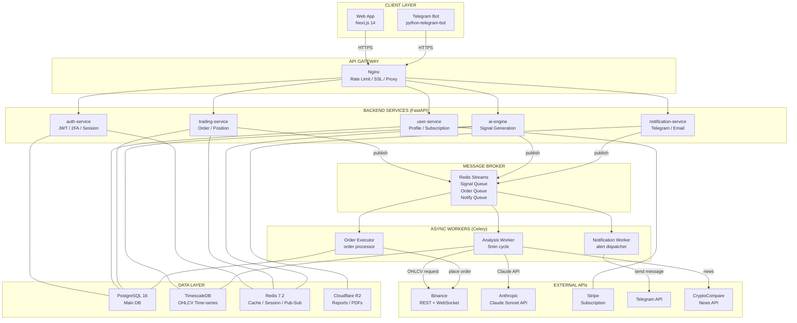

### 1.2 실시간 데이터 흐름

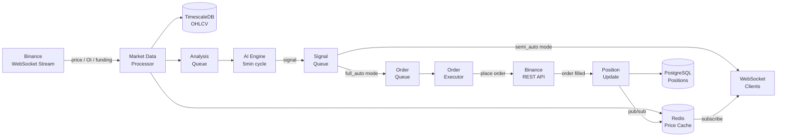

---

## 2. Frontend Architecture

### 2.1 Next.js App Router 구조

```
frontend/
├── app/
│   ├── layout.tsx                  # Root layout (폰트, 프로바이더)
│   ├── page.tsx                    # 랜딩 페이지
│   ├── (auth)/                     # 인증 불필요 그룹
│   │   ├── login/page.tsx
│   │   ├── signup/page.tsx
│   │   ├── verify-email/page.tsx
│   │   └── forgot-password/page.tsx
│   ├── (onboarding)/               # 온보딩 플로우
│   │   ├── survey/page.tsx
│   │   ├── risk-profile/page.tsx
│   │   ├── connect-binance/page.tsx
│   │   └── select-plan/page.tsx
│   └── (dashboard)/                # 인증 필요 그룹
│       ├── layout.tsx              # 사이드바 + 헤더
│       ├── dashboard/page.tsx
│       ├── signals/
│       │   ├── page.tsx
│       │   └── [id]/page.tsx
│       ├── positions/
│       │   ├── page.tsx
│       │   └── [id]/page.tsx
│       ├── journal/page.tsx
│       ├── analytics/page.tsx
│       └── settings/
│           ├── profile/page.tsx
│           ├── binance-api/page.tsx
│           ├── trading/page.tsx
│           ├── notifications/page.tsx
│           └── subscription/page.tsx
│
├── components/
│   ├── ui/                         # shadcn/ui 기본 컴포넌트
│   ├── dashboard/
│   │   ├── AccountSummaryCards.tsx
│   │   ├── PositionsTable.tsx
│   │   ├── PnlChart.tsx            # TradingView Lightweight Charts
│   │   └── RecentTradesTable.tsx
│   ├── signals/
│   │   ├── SignalCard.tsx
│   │   ├── SignalFeed.tsx
│   │   └── SignalCalculator.tsx
│   ├── positions/
│   │   ├── PositionRow.tsx
│   │   └── ClosePositionModal.tsx
│   └── common/
│       ├── AutoTradingToggle.tsx
│       └── PlanGate.tsx            # 플랜 제한 게이트
│
├── hooks/
│   ├── useWebSocket.ts             # WebSocket 연결 관리
│   ├── usePositions.ts             # 포지션 실시간 구독
│   ├── useSignals.ts               # 시그널 스트림
│   └── useAuth.ts                  # 인증 상태
│
├── store/
│   ├── authStore.ts                # Zustand: 사용자 / JWT
│   ├── positionStore.ts            # Zustand: 오픈 포지션
│   └── signalStore.ts              # Zustand: 활성 시그널
│
└── lib/
    ├── api.ts                      # TanStack Query + axios 클라이언트
    ├── websocket.ts                # WS 연결 / 재연결 로직
    └── schemas/                    # Zod 스키마 (API 응답 검증)
        ├── signal.schema.ts
        └── position.schema.ts
```

### 2.2 상태 관리 및 데이터 흐름

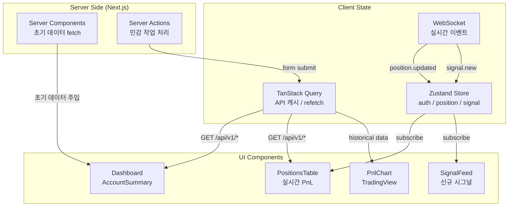

### 2.3 WebSocket 클라이언트 설계

```typescript
// hooks/useWebSocket.ts — 핵심 연결 로직
const WS_EVENTS = {
  POSITION_UPDATED: 'position.updated',
  POSITION_CLOSED:  'position.closed',
  POSITION_WARNING: 'position.warning',
  SIGNAL_NEW:       'signal.new',
  SIGNAL_EXPIRED:   'signal.expired',
} as const

// 재연결 전략: Exponential backoff (1s, 2s, 4s, 8s, max 30s)
// 백그라운드 탭: visibility API로 재연결 일시정지
// 연결 끊김: TanStack Query REST 폴백 자동 전환
```

---

## 3. Backend Architecture

### 3.1 서비스 레이어 다이어그램

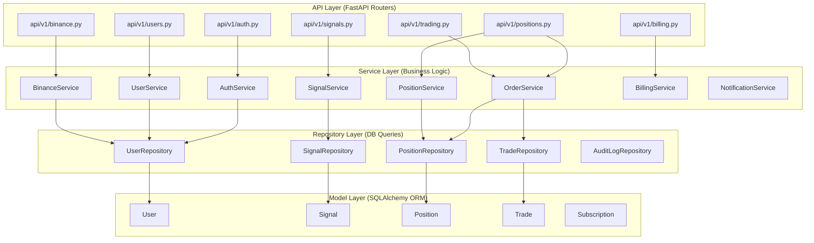

### 3.2 폴더 구조

```
backend/
├── main.py                     # FastAPI app 인스턴스, 미들웨어 등록
├── config.py                   # pydantic-settings: 환경변수 로드
├── dependencies.py             # 공통 의존성 (get_current_user 등)
│
├── api/
│   └── v1/
│       ├── __init__.py
│       ├── auth.py
│       ├── users.py
│       ├── binance.py
│       ├── signals.py
│       ├── positions.py
│       ├── trading.py
│       ├── billing.py
│       └── websocket.py        # WebSocket 핸들러
│
├── services/
│   ├── auth_service.py         # JWT 생성, 2FA, 이메일 인증
│   ├── user_service.py         # 프로파일, 리스크 설정
│   ├── binance_service.py      # Key 암호화, 권한 검증, 잔고 조회
│   ├── order_service.py        # 주문 실행, Pre-check, 포지션 사이징
│   ├── position_service.py     # 포지션 모니터링, 청산가 계산
│   ├── signal_service.py       # 시그널 CRUD, 만료 처리
│   ├── notification_service.py # 텔레그램, 이메일 발송
│   └── billing_service.py      # Stripe 구독, 플랜 동기화
│
├── repositories/
│   ├── base.py                 # 공통 CRUD 베이스
│   ├── user_repo.py
│   ├── signal_repo.py
│   ├── position_repo.py
│   ├── trade_repo.py
│   └── audit_log_repo.py
│
├── models/                     # SQLAlchemy ORM 모델
│   ├── base.py                 # Base, TimestampMixin
│   ├── user.py
│   ├── signal.py
│   ├── position.py
│   ├── trade.py
│   ├── subscription.py
│   ├── refresh_token.py
│   └── audit_log.py
│
├── schemas/                    # Pydantic v2 요청/응답 스키마
│   ├── auth.py
│   ├── user.py
│   ├── signal.py
│   ├── position.py
│   ├── order.py
│   └── billing.py
│
├── agents/                     # LangGraph AI 에이전트
│   ├── orchestrator.py         # LangGraph 그래프 정의
│   ├── technical_analyst.py
│   ├── sentiment_agent.py
│   ├── market_structure.py
│   ├── synthesis_agent.py      # Claude Sonnet 호출
│   └── risk_manager.py
│
├── workers/                    # Celery 태스크
│   ├── celery_app.py           # Celery 인스턴스
│   ├── analysis_worker.py      # 5분 주기 분석 태스크
│   ├── order_worker.py         # 주문 실행 태스크
│   └── notification_worker.py  # 알림 발송 태스크
│
├── utils/
│   ├── encryption.py           # AES-256-GCM
│   ├── jwt_handler.py          # JWT 생성/검증
│   ├── totp.py                 # TOTP 2FA
│   ├── rate_limiter.py         # Redis 기반 Rate Limit
│   └── circuit_breaker.py      # 외부 API Circuit Breaker
│
├── middleware/
│   ├── auth_middleware.py      # JWT 검증
│   ├── plan_middleware.py      # 구독 플랜 RBAC
│   └── logging_middleware.py   # 요청 로깅 (민감정보 마스킹)
│
├── migrations/                 # Alembic 마이그레이션
│   └── versions/
│
└── tests/
    ├── unit/
    ├── integration/
    └── e2e/
```

### 3.3 Order Execution — 핵심 경로

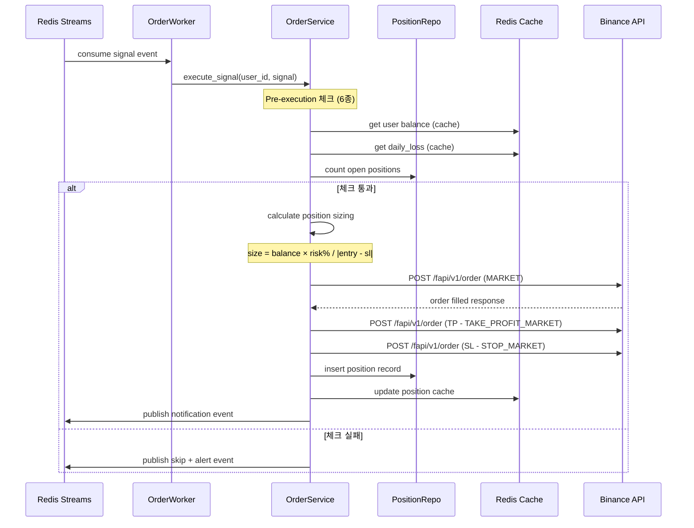

---

## 4. Agent Architecture

### 4.1 LangGraph 파이프라인

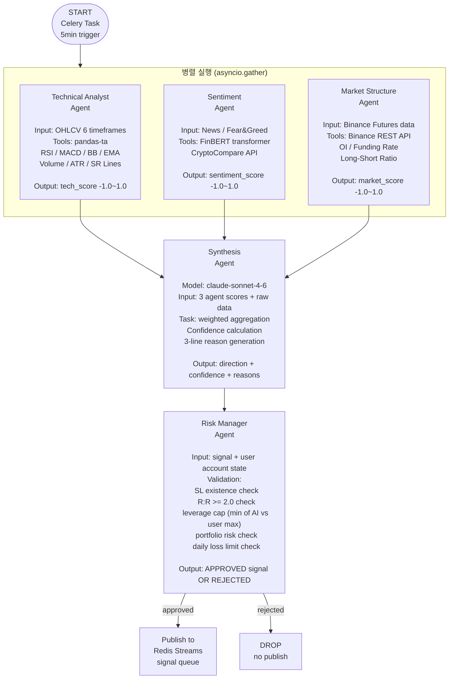

### 4.2 에이전트별 구현 상세

#### Technical Analyst Agent
```python
# agents/technical_analyst.py

INDICATORS = {
    "rsi":      {"period": 14, "timeframes": ["1h", "4h"]},
    "macd":     {"fast": 12, "slow": 26, "signal": 9},
    "bb":       {"period": 20, "std": 2},
    "ema":      {"periods": [9, 21, 50, 200]},
    "atr":      {"period": 14},
    "volume":   {"ma_period": 20},
}

# 점수 계산 로직
# +1.0 → 강한 LONG 신호
# -1.0 → 강한 SHORT 신호
# 0.0  → 중립
```

#### Synthesis Agent (Claude Sonnet)
```python
# agents/synthesis_agent.py

SYSTEM_PROMPT = """
You are a professional crypto futures trading analyst.
Given technical, sentiment, and market structure scores with raw data,
provide a trading signal with:
1. Direction: LONG / SHORT / HOLD
2. Confidence: 0.0 to 1.0
3. Entry, TP, SL prices with exact values
4. Leverage recommendation (1-20x)
5. Three specific reasons based on evidence

Rules:
- Minimum confidence to publish: 0.60
- Minimum R:R ratio: 2.0
- If R:R < 2.0, output HOLD regardless of direction
- Reasons must reference specific indicator values
"""
```

#### Risk Manager Agent
```python
# agents/risk_manager.py

def validate_signal(signal: RawSignal, account: AccountState) -> ApprovedSignal:
    assert signal.stop_loss is not None
    assert signal.rr_ratio >= 2.0
    assert signal.confidence >= 0.60

    leverage = min(signal.leverage, account.max_leverage, 20)

    size = (account.balance * account.risk_per_trade) / abs(
        signal.entry - signal.stop_loss
    )
    quantity = (size * leverage) / signal.entry

    assert account.daily_loss < account.daily_loss_limit
    assert account.open_positions < account.max_concurrent_positions

    return ApprovedSignal(quantity=quantity, leverage=leverage, ...)
```

### 4.3 LangGraph State Schema

```python
class AgentState(TypedDict):
    # 입력
    coin: str
    ohlcv: dict[str, pd.DataFrame]      # timeframe → OHLCV
    market_data: MarketData              # OI, funding, L/S ratio
    news_data: list[NewsItem]
    fear_greed_index: int

    # 에이전트 출력
    tech_score: float
    sentiment_score: float
    market_score: float

    # Synthesis 출력
    direction: Literal["LONG", "SHORT", "HOLD"]
    confidence: float
    entry_price: float
    take_profit: float
    stop_loss: float
    leverage: int
    reasons: list[str]
    rr_ratio: float

    # Risk Manager 출력
    approved: bool
    quantity: float
    rejection_reason: str | None
```

---

## 5. Database Architecture

### 5.1 ERD (핵심 테이블)

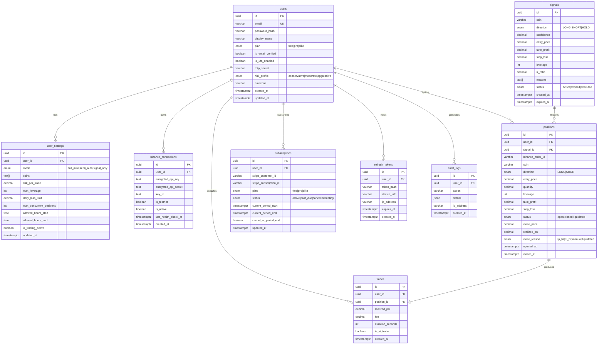

### 5.2 TimescaleDB OHLCV 스키마

```sql
-- TimescaleDB 하이퍼테이블 (시계열 최적화)
CREATE TABLE ohlcv (
    time        TIMESTAMPTZ NOT NULL,
    coin        VARCHAR(10) NOT NULL,   -- 'BTC', 'ETH'
    interval    VARCHAR(5) NOT NULL,    -- '1m', '5m', '15m', '1h', '4h', '1d'
    open        DECIMAL(18, 8) NOT NULL,
    high        DECIMAL(18, 8) NOT NULL,
    low         DECIMAL(18, 8) NOT NULL,
    close       DECIMAL(18, 8) NOT NULL,
    volume      DECIMAL(24, 8) NOT NULL
);

SELECT create_hypertable('ohlcv', 'time');
CREATE INDEX ON ohlcv (coin, interval, time DESC);

-- 보존 정책
SELECT add_retention_policy('ohlcv', INTERVAL '90 days');

-- 집계 정책 (1m → 5m → 1h 자동 롤업)
SELECT add_continuous_aggregate_policy('ohlcv_5m', ...);
```

### 5.3 인덱스 전략

```sql
-- 핵심 조회 패턴별 인덱스

-- 사용자별 오픈 포지션 조회 (대시보드 핵심 쿼리)
CREATE INDEX idx_positions_user_status
    ON positions (user_id, status)
    WHERE status = 'open';

-- 활성 시그널 조회
CREATE INDEX idx_signals_status_expires
    ON signals (status, expires_at)
    WHERE status = 'active';

-- 사용자별 거래 통계 (수익률 계산)
CREATE INDEX idx_trades_user_created
    ON trades (user_id, created_at DESC);

-- Audit Log 조회
CREATE INDEX idx_audit_logs_user_action
    ON audit_logs (user_id, action, created_at DESC);
```

---

## 6. Queue Architecture

### 6.1 Redis Streams 구조

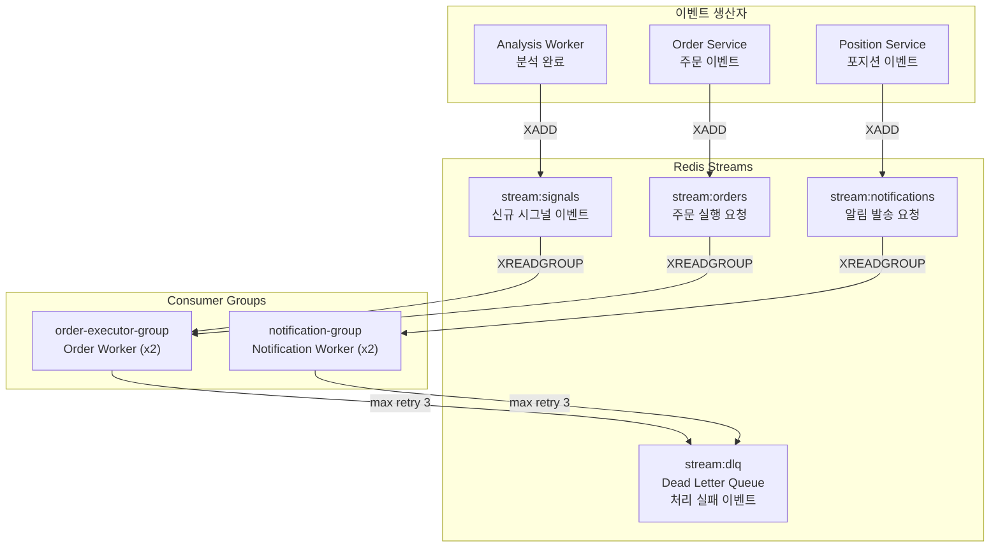

### 6.2 Celery Beat 스케줄 (정기 태스크)

```python
# workers/celery_app.py

CELERYBEAT_SCHEDULE = {
    # AI 분석 (5분 주기)
    "analyze-btc": {
        "task": "workers.analysis_worker.run_analysis",
        "schedule": crontab(minute="*/5"),
        "args": ("BTC",),
    },
    "analyze-eth": {
        "task": "workers.analysis_worker.run_analysis",
        "schedule": crontab(minute="*/5"),
        "args": ("ETH",),
    },

    # Binance API 헬스체크 (30초 주기)
    "binance-healthcheck": {
        "task": "workers.analysis_worker.check_binance_connections",
        "schedule": 30.0,
    },

    # 일일 성과 요약 알림 (매일 22:00 KST = 13:00 UTC)
    "daily-summary": {
        "task": "workers.notification_worker.send_daily_summary",
        "schedule": crontab(hour=13, minute=0),
    },

    # 만료 시그널 처리 (1분 주기)
    "expire-signals": {
        "task": "workers.analysis_worker.expire_old_signals",
        "schedule": crontab(minute="*/1"),
    },
}
```

### 6.3 Order Worker 상세 처리 흐름

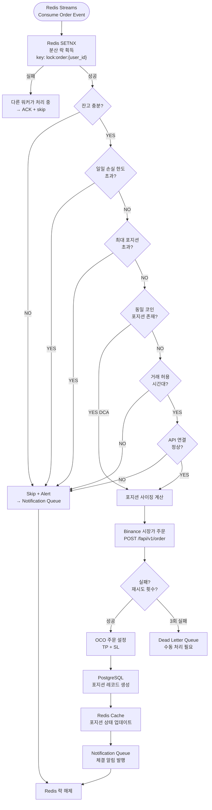

---

## 7. Redis Usage

### 7.1 Redis Key Space 설계

```
# 인증 / 세션
session:refresh:{user_id}:{token_hash}   TTL: 7d
session:active_count:{user_id}            TTL: 7d
email_verify:{email}                      TTL: 5min
password_reset:{token}                    TTL: 30min

# Rate Limiting
rate_limit:api:{user_id}                  TTL: 1min   (슬라이딩 윈도우)
rate_limit:login:{ip}                     TTL: 15min  (실패 횟수)

# 사용자 상태 캐시
user:plan:{user_id}                       TTL: 5min   (플랜 정보)
user:settings:{user_id}                   TTL: 1min   (거래 설정)
user:daily_loss:{user_id}:{date}          TTL: 25h    (일일 손실 합계)

# Binance 데이터 캐시
price:{coin}                              TTL: 1s     (실시간 가격)
balance:{user_id}                         TTL: 30s    (계좌 잔고)
positions:open:{user_id}                  TTL: 5s     (오픈 포지션)

# 시그널 캐시
signal:active:{coin}                      TTL: 1h     (활성 시그널)
signal:count:free:{user_id}:{date}        TTL: 25h    (Free 플랜 일일 카운트)

# 분산 락
lock:order:{user_id}                      TTL: 10s    (주문 실행 중복 방지)
lock:analysis:{coin}                      TTL: 60s    (분석 중복 실행 방지)

# Pub/Sub 채널
channel:positions:{user_id}              (WebSocket 브로드캐스트)
channel:signals:global                   (신규 시그널 브로드캐스트)

# Redis Streams
stream:signals                           (시그널 이벤트)
stream:orders                            (주문 요청)
stream:notifications                     (알림 요청)
stream:dlq                               (실패 이벤트)
```

### 7.2 Redis 데이터 흐름

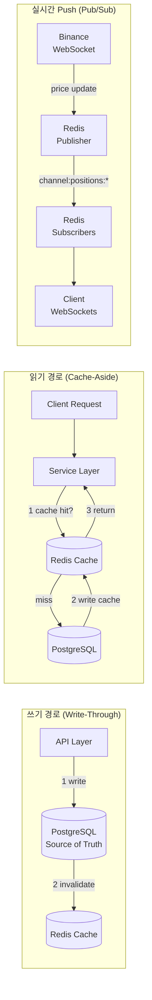

---

## 8. Security Architecture

### 8.1 인증 플로우

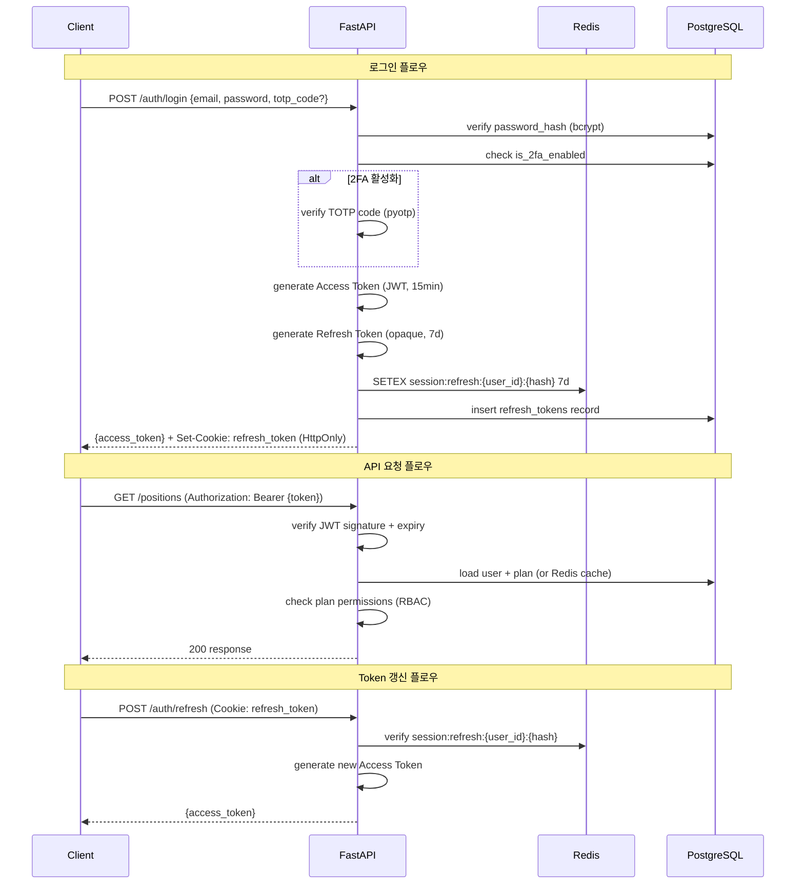

### 8.2 Binance API Key 보안 플로우

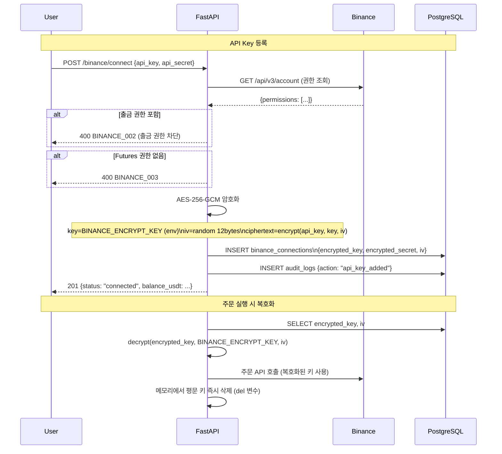

### 8.3 보안 레이어 구조

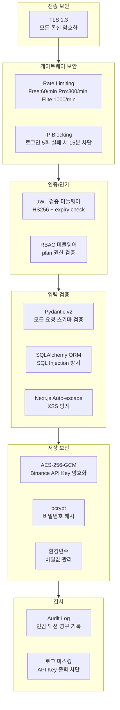

---

## 9. Deployment Architecture

### 9.1 Docker Compose (개발/스테이징)

```yaml
# docker-compose.yml

services:
  # ─── Frontend ───────────────────────────
  frontend:
    build: ./frontend
    ports: ["3000:3000"]
    environment:
      - NEXT_PUBLIC_API_URL=http://backend:8000
      - NEXT_PUBLIC_WS_URL=ws://backend:8000
    depends_on: [backend]

  # ─── Backend ────────────────────────────
  backend:
    build: ./backend
    ports: ["8000:8000"]
    env_file: .env
    depends_on: [postgres, redis]
    command: uvicorn main:app --host 0.0.0.0 --port 8000 --reload

  # ─── Celery Workers ─────────────────────
  worker-analysis:
    build: ./backend
    env_file: .env
    depends_on: [redis, postgres]
    command: celery -A workers.celery_app worker -Q analysis -c 2

  worker-order:
    build: ./backend
    env_file: .env
    depends_on: [redis, postgres]
    command: celery -A workers.celery_app worker -Q orders -c 4

  worker-notification:
    build: ./backend
    env_file: .env
    depends_on: [redis, postgres]
    command: celery -A workers.celery_app worker -Q notifications -c 2

  celery-beat:
    build: ./backend
    env_file: .env
    depends_on: [redis]
    command: celery -A workers.celery_app beat --loglevel=info

  # ─── Databases ──────────────────────────
  postgres:
    image: timescale/timescaledb:latest-pg16
    environment:
      POSTGRES_DB: trading_copilot
      POSTGRES_USER: ${DB_USER}
      POSTGRES_PASSWORD: ${DB_PASSWORD}
    volumes: [postgres_data:/var/lib/postgresql/data]
    ports: ["5432:5432"]

  redis:
    image: redis:7.2-alpine
    command: redis-server --requirepass ${REDIS_PASSWORD} --maxmemory 512mb
    volumes: [redis_data:/data]
    ports: ["6379:6379"]

  # ─── Monitoring ─────────────────────────
  prometheus:
    image: prom/prometheus
    volumes: [./monitoring/prometheus.yml:/etc/prometheus/prometheus.yml]
    ports: ["9090:9090"]

  grafana:
    image: grafana/grafana
    ports: ["3001:3000"]
    volumes: [grafana_data:/var/lib/grafana]
    environment:
      GF_SECURITY_ADMIN_PASSWORD: ${GRAFANA_PASSWORD}
```

### 9.2 CI/CD 파이프라인

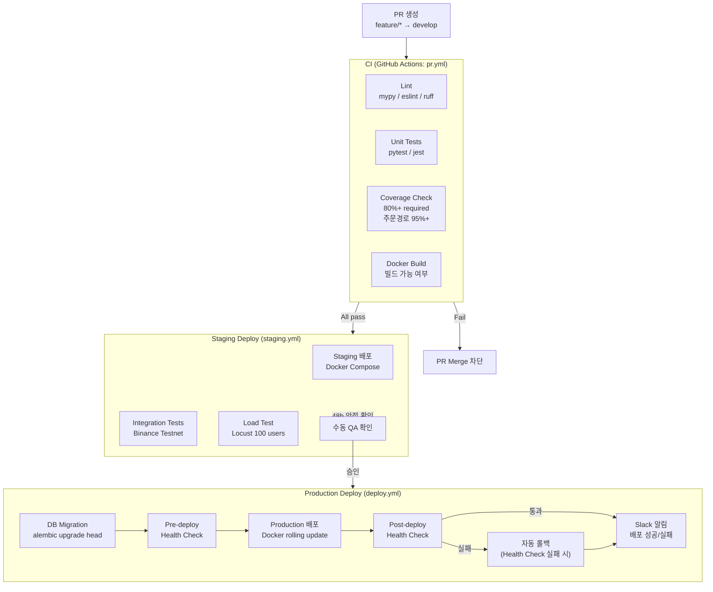

### 9.3 프로덕션 서버 구성

```
Production 서버 (단일 서버 — MVP):

┌─────────────────────────────────────────────┐
│               Ubuntu 22.04 LTS              │
│                                             │
│  ┌─────────┐  ┌──────────┐  ┌──────────┐  │
│  │  Nginx  │  │ Frontend │  │ Backend  │  │
│  │ :80/443 │  │  :3000   │  │  :8000   │  │
│  └────┬────┘  └──────────┘  └──────────┘  │
│       │                                     │
│  ┌────┴────────────────────────────────┐   │
│  │           Docker Network            │   │
│  │                                     │   │
│  │  ┌──────┐  ┌──────┐  ┌─────────┐  │   │
│  │  │ PG   │  │Redis │  │Workers  │  │   │
│  │  │:5432 │  │:6379 │  │Celery   │  │   │
│  │  └──────┘  └──────┘  └─────────┘  │   │
│  └─────────────────────────────────────┘   │
│                                             │
│  ┌─────────────────────────────────────┐   │
│  │  Monitoring (separate port)          │   │
│  │  Prometheus :9090 │ Grafana :3001   │   │
│  └─────────────────────────────────────┘   │
└─────────────────────────────────────────────┘

SSL: Let's Encrypt (자동 갱신)
백업: 매일 01:00 PostgreSQL dump → Cloudflare R2
로그: /var/log/trading-copilot/ → Loki
```

---

## 10. Monitoring Architecture

### 10.1 관측성 스택

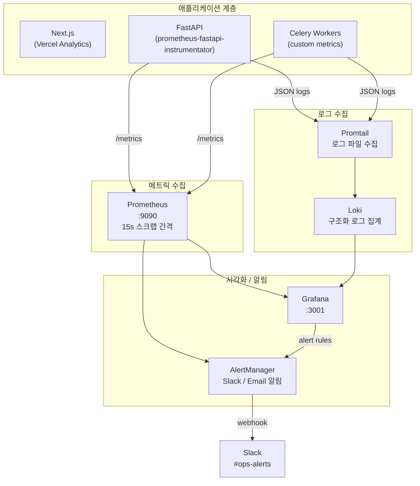

### 10.2 핵심 모니터링 지표

```yaml
# Grafana 대시보드 — 비즈니스 메트릭
business_metrics:
  - trading_signal_generated_total          # 시그널 생성 횟수
  - trading_order_executed_total            # 주문 실행 횟수
  - trading_order_success_rate              # 주문 성공률 (목표: >99.5%)
  - trading_position_liquidated_total       # 강제청산 발생 횟수
  - active_auto_trading_users               # 자동매매 활성 사용자 수
  - subscription_mrr_usd                    # 월간 구독 수익

# Grafana 대시보드 — 시스템 메트릭
system_metrics:
  - http_request_duration_seconds           # API 응답시간 (목표: p95 < 500ms)
  - http_requests_total                     # 요청 총량 / 에러율
  - order_execution_duration_ms             # 주문 실행 지연 (목표: p99 < 200ms)
  - signal_generation_duration_seconds      # 시그널 생성 시간 (목표: < 3s)
  - websocket_connections_active            # 활성 WebSocket 연결 수
  - celery_task_queue_length                # 태스크 큐 대기 길이
  - redis_memory_used_bytes                 # Redis 메모리 사용량
  - postgresql_slow_queries_total           # 슬로우 쿼리 (> 100ms)

# AlertManager 알림 규칙
alert_rules:
  critical:
    - order_success_rate < 0.99             # 주문 성공률 99% 미만
    - service_uptime < 0.999               # 가용성 99.9% 미만
    - liquidation_count > 0               # 강제청산 발생 즉시
    - api_error_rate > 0.01               # 에러율 1% 초과

  warning:
    - p95_latency > 300ms                 # API 지연 경고
    - celery_queue_length > 100           # 큐 적체 경고
    - redis_memory_usage > 80%            # Redis 메모리 경고
    - signal_generation_time > 2s         # 시그널 생성 지연 경고
```

### 10.3 로그 구조화 포맷

```python
# 모든 로그는 JSON 구조화 형식으로 출력
# 민감 정보(API Key, Token)는 자동 마스킹

import structlog

logger = structlog.get_logger()

# 주문 실행 로그 예시
logger.info(
    "order_executed",
    user_id=str(user_id),        # UUID만 (이메일 금지)
    coin="BTC",
    direction="LONG",
    quantity=0.015,
    entry_price=67450.0,
    latency_ms=142,
    binance_order_id="...",
    # api_key: 절대 로깅 금지
)

# 에러 로그 예시
logger.error(
    "order_failed",
    user_id=str(user_id),
    error_code="BINANCE_001",
    retry_count=2,
    exc_info=True,
)
```

### 10.4 헬스체크 엔드포인트

```python
# GET /health — 로드밸런서용 빠른 체크
# 응답: {"status": "ok"} 200 or 503

# GET /health/detailed — 상세 의존성 체크
# 응답:
{
  "status": "ok",
  "checks": {
    "postgresql":         {"status": "ok", "latency_ms": 3},
    "redis":              {"status": "ok", "latency_ms": 1},
    "binance_api":        {"status": "ok", "latency_ms": 45},
    "anthropic_api":      {"status": "ok", "latency_ms": 120},
    "celery_workers":     {"status": "ok", "active_workers": 4}
  },
  "version": "1.0.0",
  "uptime_seconds": 86400
}
```

---

## 부록: 핵심 의존성 버전

```toml
# backend/pyproject.toml (핵심)
[tool.poetry.dependencies]
python = "^3.12"
fastapi = "^0.115"
uvicorn = {extras = ["standard"], version = "^0.32"}
sqlalchemy = {extras = ["asyncio"], version = "^2.0"}
alembic = "^1.14"
pydantic = {extras = ["email"], version = "^2.10"}
pydantic-settings = "^2.7"
celery = {extras = ["redis"], version = "^5.4"}
redis = {extras = ["hiredis"], version = "^5.2"}
langgraph = "^0.2"
anthropic = "^0.40"
pandas-ta = "^0.3"
transformers = "^4.47"          # FinBERT
python-jose = "^3.3"            # JWT
passlib = {extras = ["bcrypt"], version = "^1.7"}
pyotp = "^2.9"                  # TOTP 2FA
cryptography = "^44.0"          # AES-256-GCM
stripe = "^11.3"
python-telegram-bot = "^21.9"
prometheus-fastapi-instrumentator = "^7.0"
structlog = "^24.4"
```

```json
// frontend/package.json (핵심)
{
  "dependencies": {
    "next": "14.2.x",
    "react": "^18.3",
    "typescript": "^5.6",
    "tailwindcss": "^3.4",
    "@shadcn/ui": "latest",
    "lightweight-charts": "^4.2",
    "zustand": "^5.0",
    "@tanstack/react-query": "^5.62",
    "zod": "^3.23",
    "axios": "^1.7"
  }
}
```

---

> 이 문서는 구현 가이드다.
> 각 컴포넌트의 인터페이스가 변경될 때 반드시 이 문서를 함께 업데이트한다.
> 아키텍처 결정의 최종 권한은 CLAUDE.md와 PROJECT_CHARTER.md에 있다.
