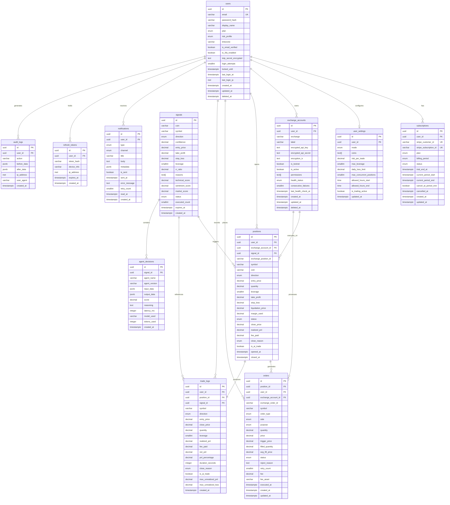

# AI Trading Copilot — Database Design

> 작성일: 2026-06-04
> 버전: v1.0
> DBMS: PostgreSQL 16 + TimescaleDB extension
> 참조: ARCHITECTURE.md, PRD.md, CLAUDE.md

---

## 목차

1. [설계 원칙](#1-설계-원칙)
2. [ERD (전체 관계도)](#2-erd-전체-관계도)
3. [공통 설정](#3-공통-설정)
4. [users](#4-users)
5. [subscriptions](#5-subscriptions)
6. [exchange_accounts](#6-exchange_accounts)
7. [signals](#7-signals)
8. [positions](#8-positions)
9. [orders](#9-orders)
10. [trade_logs](#10-trade_logs)
11. [agent_decisions](#11-agent_decisions)
12. [notifications](#12-notifications)
13. [보조 테이블](#13-보조-테이블)
14. [마이그레이션 전략](#14-마이그레이션-전략)

---

## 1. 설계 원칙

```
1. 금융 데이터는 DECIMAL(20,8)  — FLOAT 절대 사용 금지 (부동소수점 오차)
2. 모든 시간은 TIMESTAMPTZ      — 타임존 명시 (서버는 UTC 기준)
3. PK는 UUID                    — 분산 환경에서 충돌 없는 ID 생성
4. Soft Delete                  — 금융 데이터는 물리 삭제 금지 (deleted_at)
5. PostgreSQL이 Source of Truth — Redis는 캐시 전용, 쓰기는 항상 PG 먼저
6. 민감 데이터는 앱 레벨 암호화 — API Key는 AES-256-GCM 암호화 후 저장
7. Audit 불변                   — audit_logs는 UPDATE/DELETE 금지 (append-only)
8. JSONB for flexible data      — 에이전트 입출력 등 스키마가 변할 수 있는 데이터
```

---

## 2. ERD (전체 관계도)



---

## 3. 공통 설정

### 3.1 ENUM 타입 사전 정의

```sql
-- 사용자
CREATE TYPE plan_type AS ENUM ('free', 'pro', 'elite');
CREATE TYPE risk_profile_type AS ENUM ('conservative', 'moderate', 'aggressive');

-- 구독
CREATE TYPE billing_period_type AS ENUM ('monthly', 'yearly');
CREATE TYPE subscription_status_type AS ENUM (
    'trialing', 'active', 'past_due', 'cancelled', 'incomplete', 'incomplete_expired'
);

-- 거래소 계좌
CREATE TYPE exchange_type AS ENUM ('binance', 'bybit', 'okx');
CREATE TYPE health_status_type AS ENUM ('healthy', 'degraded', 'disconnected');

-- 시그널
CREATE TYPE signal_direction_type AS ENUM ('LONG', 'SHORT', 'HOLD');
CREATE TYPE signal_status_type AS ENUM ('active', 'expired', 'executed', 'dismissed');

-- 포지션
CREATE TYPE position_status_type AS ENUM ('open', 'closed', 'liquidated', 'cancelled');
CREATE TYPE close_reason_type AS ENUM (
    'tp_hit', 'sl_hit', 'manual', 'liquidated', 'emergency', 'dca_reversal'
);

-- 주문
CREATE TYPE order_type_enum AS ENUM (
    'market', 'limit', 'stop_market', 'take_profit_market', 'trailing_stop'
);
CREATE TYPE order_side_type AS ENUM ('BUY', 'SELL');
CREATE TYPE order_purpose_type AS ENUM (
    'entry', 'take_profit', 'stop_loss', 'emergency_close', 'dca', 'partial_close'
);
CREATE TYPE order_status_type AS ENUM (
    'pending', 'open', 'partially_filled', 'filled', 'cancelled', 'rejected', 'expired'
);

-- 자동매매 모드
CREATE TYPE trading_mode_type AS ENUM ('full_auto', 'semi_auto', 'signal_only');

-- 알림
CREATE TYPE notification_type_enum AS ENUM (
    'signal_new', 'order_filled', 'order_failed', 'position_closed',
    'liquidation_warning', 'daily_summary', 'system_alert',
    'payment_failed', 'api_key_issue'
);
CREATE TYPE notification_channel_type AS ENUM ('telegram', 'email', 'web_push');
```

### 3.2 공통 트리거 함수

```sql
-- updated_at 자동 갱신 트리거 함수
CREATE OR REPLACE FUNCTION update_updated_at_column()
RETURNS TRIGGER AS $$
BEGIN
    NEW.updated_at = NOW();
    RETURN NEW;
END;
$$ LANGUAGE plpgsql;

-- UUID 자동 생성 확장
CREATE EXTENSION IF NOT EXISTS "pgcrypto";
CREATE EXTENSION IF NOT EXISTS "timescaledb";
```

---

## 4. users

### 4.1 DDL

```sql
CREATE TABLE users (
    -- PK
    id                      UUID PRIMARY KEY DEFAULT gen_random_uuid(),

    -- 인증 정보
    email                   VARCHAR(255)    NOT NULL,
    password_hash           VARCHAR(255)    NOT NULL,   -- bcrypt (cost=12)

    -- 프로파일
    display_name            VARCHAR(100),
    plan                    plan_type       NOT NULL DEFAULT 'free',
    risk_profile            risk_profile_type NOT NULL DEFAULT 'moderate',
    timezone                VARCHAR(50)     NOT NULL DEFAULT 'Asia/Seoul',

    -- 이메일 인증
    is_email_verified       BOOLEAN         NOT NULL DEFAULT FALSE,
    email_verify_token      VARCHAR(64),                -- 인증 중 임시 저장
    email_verify_expires_at TIMESTAMPTZ,

    -- 2FA
    is_2fa_enabled          BOOLEAN         NOT NULL DEFAULT FALSE,
    totp_secret_encrypted   TEXT,                       -- AES-256-GCM 암호화
    totp_backup_codes       TEXT[],                     -- 8개 백업 코드 (해시)

    -- 보안
    login_attempts          SMALLINT        NOT NULL DEFAULT 0,
    locked_until            TIMESTAMPTZ,                -- 계정 잠금 해제 시각
    last_login_at           TIMESTAMPTZ,
    last_login_ip           INET,
    password_changed_at     TIMESTAMPTZ,

    -- 삭제
    deleted_at              TIMESTAMPTZ,                -- Soft Delete

    -- 타임스탬프
    created_at              TIMESTAMPTZ     NOT NULL DEFAULT NOW(),
    updated_at              TIMESTAMPTZ     NOT NULL DEFAULT NOW(),

    -- 제약조건
    CONSTRAINT users_email_format
        CHECK (email ~* '^[A-Za-z0-9._%+-]+@[A-Za-z0-9.-]+\.[A-Za-z]{2,}$'),
    CONSTRAINT users_login_attempts_range
        CHECK (login_attempts >= 0 AND login_attempts <= 10)
);
```

### 4.2 인덱스

```sql
-- 로그인 조회 (가장 빈번한 쿼리)
CREATE UNIQUE INDEX idx_users_email_active
    ON users (email)
    WHERE deleted_at IS NULL;

-- Soft Delete 전체 조회
CREATE INDEX idx_users_deleted_at
    ON users (deleted_at)
    WHERE deleted_at IS NOT NULL;

-- 플랜별 사용자 집계 (통계용)
CREATE INDEX idx_users_plan
    ON users (plan)
    WHERE deleted_at IS NULL;
```

### 4.3 트리거

```sql
CREATE TRIGGER users_updated_at
    BEFORE UPDATE ON users
    FOR EACH ROW EXECUTE FUNCTION update_updated_at_column();

-- 로그인 실패 자동 잠금 트리거
CREATE OR REPLACE FUNCTION check_login_lockout()
RETURNS TRIGGER AS $$
BEGIN
    IF NEW.login_attempts >= 5 AND OLD.login_attempts < 5 THEN
        NEW.locked_until = NOW() + INTERVAL '15 minutes';
    END IF;
    RETURN NEW;
END;
$$ LANGUAGE plpgsql;

CREATE TRIGGER users_login_lockout
    BEFORE UPDATE OF login_attempts ON users
    FOR EACH ROW EXECUTE FUNCTION check_login_lockout();
```

### 4.4 관계

| 참조 테이블 | 참조 컬럼 | 관계 | 정책 |
|------------|---------|------|------|
| subscriptions | user_id | 1:1 | ON DELETE CASCADE |
| user_settings | user_id | 1:1 | ON DELETE CASCADE |
| exchange_accounts | user_id | 1:N | ON DELETE CASCADE |
| positions | user_id | 1:N | ON DELETE RESTRICT |
| trade_logs | user_id | 1:N | ON DELETE RESTRICT |
| notifications | user_id | 1:N | ON DELETE CASCADE |
| refresh_tokens | user_id | 1:N | ON DELETE CASCADE |
| audit_logs | user_id | 1:N | ON DELETE SET NULL |

---

## 5. subscriptions

### 5.1 DDL

```sql
CREATE TABLE subscriptions (
    -- PK
    id                      UUID PRIMARY KEY DEFAULT gen_random_uuid(),

    -- 관계
    user_id                 UUID            NOT NULL,

    -- Stripe 연동
    stripe_customer_id      VARCHAR(100),               -- cus_xxx
    stripe_subscription_id  VARCHAR(100),               -- sub_xxx
    stripe_price_id         VARCHAR(100),               -- price_xxx

    -- 플랜 정보
    plan                    plan_type       NOT NULL DEFAULT 'free',
    billing_period          billing_period_type,        -- free는 NULL
    status                  subscription_status_type NOT NULL DEFAULT 'active',

    -- 기간 정보
    trial_end_at            TIMESTAMPTZ,
    current_period_start    TIMESTAMPTZ,
    current_period_end      TIMESTAMPTZ,
    cancel_at_period_end    BOOLEAN         NOT NULL DEFAULT FALSE,
    cancelled_at            TIMESTAMPTZ,

    -- 결제 실패 관리
    past_due_since          TIMESTAMPTZ,                -- past_due 시작 시각
    grace_period_end_at     TIMESTAMPTZ,                -- 유예기간 종료 (past_due + 3일)

    -- 타임스탬프
    created_at              TIMESTAMPTZ     NOT NULL DEFAULT NOW(),
    updated_at              TIMESTAMPTZ     NOT NULL DEFAULT NOW(),

    -- 제약조건
    CONSTRAINT subscriptions_user_id_fk
        FOREIGN KEY (user_id) REFERENCES users(id) ON DELETE CASCADE,
    CONSTRAINT subscriptions_stripe_ids_unique
        UNIQUE (stripe_subscription_id),
    CONSTRAINT subscriptions_stripe_customer_unique
        UNIQUE (stripe_customer_id),
    CONSTRAINT subscriptions_period_order
        CHECK (current_period_start < current_period_end),
    CONSTRAINT subscriptions_free_no_billing
        CHECK (
            (plan = 'free' AND billing_period IS NULL AND stripe_subscription_id IS NULL)
            OR plan != 'free'
        )
);
```

### 5.2 인덱스

```sql
-- 사용자별 구독 조회 (플랜 확인 — 매 요청마다 실행)
CREATE UNIQUE INDEX idx_subscriptions_user_active
    ON subscriptions (user_id)
    WHERE status IN ('active', 'trialing', 'past_due');

-- Stripe Webhook 처리 (subscription_id로 사용자 조회)
CREATE INDEX idx_subscriptions_stripe_subscription
    ON subscriptions (stripe_subscription_id)
    WHERE stripe_subscription_id IS NOT NULL;

-- 만료 예정 구독 조회 (자동 갱신 배치)
CREATE INDEX idx_subscriptions_period_end
    ON subscriptions (current_period_end)
    WHERE status = 'active';

-- past_due 유예기간 만료 처리
CREATE INDEX idx_subscriptions_grace_period
    ON subscriptions (grace_period_end_at)
    WHERE status = 'past_due';
```

### 5.3 트리거

```sql
CREATE TRIGGER subscriptions_updated_at
    BEFORE UPDATE ON subscriptions
    FOR EACH ROW EXECUTE FUNCTION update_updated_at_column();

-- 구독 취소 시 users.plan 동기화
CREATE OR REPLACE FUNCTION sync_user_plan_on_subscription_change()
RETURNS TRIGGER AS $$
BEGIN
    IF NEW.status IN ('cancelled', 'incomplete_expired') THEN
        UPDATE users SET plan = 'free', updated_at = NOW()
        WHERE id = NEW.user_id;
    ELSIF NEW.status IN ('active', 'trialing') THEN
        UPDATE users SET plan = NEW.plan, updated_at = NOW()
        WHERE id = NEW.user_id;
    END IF;
    RETURN NEW;
END;
$$ LANGUAGE plpgsql;

CREATE TRIGGER subscriptions_sync_user_plan
    AFTER UPDATE OF status, plan ON subscriptions
    FOR EACH ROW EXECUTE FUNCTION sync_user_plan_on_subscription_change();
```

### 5.4 관계

| 참조 테이블 | 참조 컬럼 | 관계 | 정책 |
|------------|---------|------|------|
| users | user_id | N:1 | ON DELETE CASCADE |

---

## 6. exchange_accounts

### 6.1 DDL

```sql
CREATE TABLE exchange_accounts (
    -- PK
    id                      UUID PRIMARY KEY DEFAULT gen_random_uuid(),

    -- 관계
    user_id                 UUID            NOT NULL,

    -- 거래소 정보
    exchange                exchange_type   NOT NULL DEFAULT 'binance',
    label                   VARCHAR(100)    NOT NULL DEFAULT 'Main Account',

    -- API Key (AES-256-GCM 암호화)
    encrypted_api_key       TEXT            NOT NULL,
    encrypted_api_secret    TEXT            NOT NULL,
    encryption_iv           TEXT            NOT NULL,   -- 12-byte IV (Base64)
    key_fingerprint         VARCHAR(16),                -- 마지막 4자 (UI 표시용)

    -- 환경 및 설정
    is_testnet              BOOLEAN         NOT NULL DEFAULT FALSE,
    is_active               BOOLEAN         NOT NULL DEFAULT TRUE,
    permissions             TEXT[]          NOT NULL DEFAULT '{}',

    -- 헬스체크
    health_status           health_status_type NOT NULL DEFAULT 'healthy',
    consecutive_failures    SMALLINT        NOT NULL DEFAULT 0,
    last_health_check_at    TIMESTAMPTZ,
    last_error_message      TEXT,

    -- 잔고 캐시 (헬스체크 시 갱신)
    cached_balance_usdt     DECIMAL(20,8),
    balance_updated_at      TIMESTAMPTZ,

    -- Soft Delete
    deleted_at              TIMESTAMPTZ,

    -- 타임스탬프
    created_at              TIMESTAMPTZ     NOT NULL DEFAULT NOW(),
    updated_at              TIMESTAMPTZ     NOT NULL DEFAULT NOW(),

    -- 제약조건
    CONSTRAINT exchange_accounts_user_id_fk
        FOREIGN KEY (user_id) REFERENCES users(id) ON DELETE CASCADE,
    CONSTRAINT exchange_accounts_no_withdraw
        CHECK (NOT ('Withdraw' = ANY(permissions))),
    CONSTRAINT exchange_accounts_failures_range
        CHECK (consecutive_failures >= 0),
    CONSTRAINT exchange_accounts_balance_non_negative
        CHECK (cached_balance_usdt IS NULL OR cached_balance_usdt >= 0)
);
```

### 6.2 인덱스

```sql
-- 사용자별 활성 계좌 조회
CREATE INDEX idx_exchange_accounts_user_active
    ON exchange_accounts (user_id, is_active)
    WHERE deleted_at IS NULL;

-- 헬스체크 대상 조회 (30초 주기 워커)
CREATE INDEX idx_exchange_accounts_health_check
    ON exchange_accounts (last_health_check_at NULLS FIRST)
    WHERE is_active = TRUE AND deleted_at IS NULL;

-- 비정상 계좌 감지
CREATE INDEX idx_exchange_accounts_unhealthy
    ON exchange_accounts (user_id, health_status)
    WHERE health_status != 'healthy' AND deleted_at IS NULL;
```

### 6.3 트리거

```sql
CREATE TRIGGER exchange_accounts_updated_at
    BEFORE UPDATE ON exchange_accounts
    FOR EACH ROW EXECUTE FUNCTION update_updated_at_column();

-- 3회 연속 실패 시 자동 비활성화
CREATE OR REPLACE FUNCTION auto_deactivate_on_failures()
RETURNS TRIGGER AS $$
BEGIN
    IF NEW.consecutive_failures >= 3 THEN
        NEW.is_active = FALSE;
        NEW.health_status = 'disconnected';
    END IF;
    RETURN NEW;
END;
$$ LANGUAGE plpgsql;

CREATE TRIGGER exchange_accounts_auto_deactivate
    BEFORE UPDATE OF consecutive_failures ON exchange_accounts
    FOR EACH ROW EXECUTE FUNCTION auto_deactivate_on_failures();
```

### 6.4 관계

| 참조 테이블 | 참조 컬럼 | 관계 | 정책 |
|------------|---------|------|------|
| users | user_id | N:1 | ON DELETE CASCADE |
| positions | exchange_account_id | 1:N | ON DELETE RESTRICT |
| orders | exchange_account_id | 1:N | ON DELETE RESTRICT |

---

## 7. signals

### 7.1 DDL

```sql
CREATE TABLE signals (
    -- PK
    id                      UUID PRIMARY KEY DEFAULT gen_random_uuid(),

    -- 시그널 대상
    coin                    VARCHAR(10)     NOT NULL,   -- 'BTC', 'ETH'
    symbol                  VARCHAR(20)     NOT NULL,   -- 'BTCUSDT'

    -- 시그널 핵심 데이터
    direction               signal_direction_type NOT NULL,
    confidence              DECIMAL(5,4)    NOT NULL,   -- 0.0000 ~ 1.0000

    -- 가격 정보 (8자리 소수 — 정밀도 보장)
    entry_price             DECIMAL(20,8)   NOT NULL,
    take_profit             DECIMAL(20,8),              -- HOLD 시 NULL
    stop_loss               DECIMAL(20,8),              -- HOLD 시 NULL
    leverage                SMALLINT,                   -- 1 ~ 20
    rr_ratio                DECIMAL(8,4),               -- 최소 2.0

    -- 근거
    reasons                 TEXT[]          NOT NULL DEFAULT '{}',

    -- 에이전트 점수 (추적용)
    technical_score         DECIMAL(5,4),               -- -1.0 ~ 1.0
    sentiment_score         DECIMAL(5,4),
    market_score            DECIMAL(5,4),

    -- 상태 관리
    status                  signal_status_type NOT NULL DEFAULT 'active',
    executed_count          SMALLINT        NOT NULL DEFAULT 0, -- 실행한 사용자 수

    -- 유효기간
    expires_at              TIMESTAMPTZ     NOT NULL,

    -- 타임스탬프
    created_at              TIMESTAMPTZ     NOT NULL DEFAULT NOW(),

    -- 제약조건
    CONSTRAINT signals_confidence_range
        CHECK (confidence >= 0 AND confidence <= 1),
    CONSTRAINT signals_rr_ratio_minimum
        CHECK (rr_ratio IS NULL OR rr_ratio >= 2.0),
    CONSTRAINT signals_leverage_range
        CHECK (leverage IS NULL OR (leverage >= 1 AND leverage <= 20)),
    CONSTRAINT signals_price_positive
        CHECK (entry_price > 0),
    CONSTRAINT signals_tp_sl_required_for_direction
        CHECK (
            direction = 'HOLD'
            OR (take_profit IS NOT NULL AND stop_loss IS NOT NULL)
        ),
    CONSTRAINT signals_expires_after_created
        CHECK (expires_at > created_at),
    CONSTRAINT signals_score_range
        CHECK (
            (technical_score IS NULL OR (technical_score >= -1 AND technical_score <= 1)) AND
            (sentiment_score IS NULL OR (sentiment_score >= -1 AND sentiment_score <= 1)) AND
            (market_score IS NULL OR (market_score >= -1 AND market_score <= 1))
        )
);
```

### 7.2 인덱스

```sql
-- 활성 시그널 피드 조회 (메인 대시보드 — 가장 빈번)
CREATE INDEX idx_signals_active_created
    ON signals (status, created_at DESC)
    WHERE status = 'active';

-- 코인별 활성 시그널 (중복 시그널 방지)
CREATE UNIQUE INDEX idx_signals_coin_active_unique
    ON signals (coin)
    WHERE status = 'active';

-- 만료 처리 배치 (1분 주기)
CREATE INDEX idx_signals_expires_at
    ON signals (expires_at)
    WHERE status = 'active';

-- 신뢰도별 필터링
CREATE INDEX idx_signals_confidence
    ON signals (confidence DESC, created_at DESC)
    WHERE status = 'active';

-- 사용자 시그널 실행 이력 조회
CREATE INDEX idx_signals_direction_coin
    ON signals (direction, coin, created_at DESC);
```

### 7.3 관계

| 참조 테이블 | 참조 컬럼 | 관계 | 정책 |
|------------|---------|------|------|
| positions | signal_id | 1:N | ON DELETE SET NULL |
| trade_logs | signal_id | 1:N | ON DELETE SET NULL |
| agent_decisions | signal_id | 1:N | ON DELETE CASCADE |

---

## 8. positions

### 8.1 DDL

```sql
CREATE TABLE positions (
    -- PK
    id                      UUID PRIMARY KEY DEFAULT gen_random_uuid(),

    -- 관계
    user_id                 UUID            NOT NULL,
    exchange_account_id     UUID            NOT NULL,
    signal_id               UUID,                       -- 수동 포지션이면 NULL

    -- 거래소 식별자
    exchange_position_id    VARCHAR(100),               -- Binance 내부 포지션 ID

    -- 포지션 기본 정보
    symbol                  VARCHAR(20)     NOT NULL,   -- 'BTCUSDT'
    coin                    VARCHAR(10)     NOT NULL,   -- 'BTC'
    direction               signal_direction_type NOT NULL
                            CHECK (direction IN ('LONG', 'SHORT')),

    -- 진입 정보
    entry_price             DECIMAL(20,8)   NOT NULL,
    quantity                DECIMAL(20,8)   NOT NULL,
    leverage                SMALLINT        NOT NULL,
    margin_used             DECIMAL(20,8),              -- 사용된 증거금

    -- TP/SL
    take_profit             DECIMAL(20,8),
    stop_loss               DECIMAL(20,8)   NOT NULL,   -- SL 없는 포지션 금지
    liquidation_price       DECIMAL(20,8),

    -- 트레일링 스탑
    trailing_stop_enabled   BOOLEAN         NOT NULL DEFAULT FALSE,
    trailing_stop_callback  DECIMAL(5,2),               -- % (예: 1.5%)

    -- 상태
    status                  position_status_type NOT NULL DEFAULT 'open',

    -- 청산 정보
    close_price             DECIMAL(20,8),
    realized_pnl            DECIMAL(20,8),
    fee_paid                DECIMAL(20,8)   NOT NULL DEFAULT 0,
    close_reason            close_reason_type,

    -- 메타
    is_ai_trade             BOOLEAN         NOT NULL DEFAULT TRUE,
    notes                   TEXT,                       -- 사용자 메모

    -- 타임스탬프
    opened_at               TIMESTAMPTZ     NOT NULL DEFAULT NOW(),
    closed_at               TIMESTAMPTZ,

    -- 제약조건
    CONSTRAINT positions_user_id_fk
        FOREIGN KEY (user_id) REFERENCES users(id) ON DELETE RESTRICT,
    CONSTRAINT positions_exchange_account_fk
        FOREIGN KEY (exchange_account_id) REFERENCES exchange_accounts(id)
            ON DELETE RESTRICT,
    CONSTRAINT positions_signal_id_fk
        FOREIGN KEY (signal_id) REFERENCES signals(id) ON DELETE SET NULL,
    CONSTRAINT positions_stop_loss_required
        CHECK (stop_loss IS NOT NULL),
    CONSTRAINT positions_leverage_range
        CHECK (leverage >= 1 AND leverage <= 20),
    CONSTRAINT positions_quantity_positive
        CHECK (quantity > 0),
    CONSTRAINT positions_entry_price_positive
        CHECK (entry_price > 0),
    CONSTRAINT positions_closed_has_close_price
        CHECK (
            (status = 'open') OR
            (status IN ('closed', 'liquidated') AND close_price IS NOT NULL)
        ),
    CONSTRAINT positions_closed_at_after_opened
        CHECK (closed_at IS NULL OR closed_at >= opened_at)
);
```

### 8.2 인덱스

```sql
-- 사용자별 오픈 포지션 (대시보드 핵심 — 1초 갱신)
CREATE INDEX idx_positions_user_open
    ON positions (user_id, opened_at DESC)
    WHERE status = 'open';

-- 거래소 계좌별 포지션 수 (동시 포지션 한도 체크)
CREATE INDEX idx_positions_account_open_count
    ON positions (exchange_account_id)
    WHERE status = 'open';

-- 코인별 오픈 포지션 (동일 코인 중복 체크)
CREATE INDEX idx_positions_user_coin_open
    ON positions (user_id, coin)
    WHERE status = 'open';

-- 시그널 실행 여부 추적
CREATE INDEX idx_positions_signal
    ON positions (signal_id)
    WHERE signal_id IS NOT NULL;

-- 청산가 경보 계산 (포지션 모니터링 워커)
CREATE INDEX idx_positions_open_liquidation
    ON positions (liquidation_price)
    WHERE status = 'open' AND liquidation_price IS NOT NULL;

-- 수익률 통계 쿼리 (analytics)
CREATE INDEX idx_positions_user_closed
    ON positions (user_id, closed_at DESC)
    WHERE status IN ('closed', 'liquidated');
```

### 8.3 관계

| 참조 테이블 | 참조 컬럼 | 관계 | 정책 |
|------------|---------|------|------|
| users | user_id | N:1 | ON DELETE RESTRICT |
| exchange_accounts | exchange_account_id | N:1 | ON DELETE RESTRICT |
| signals | signal_id | N:1 | ON DELETE SET NULL |
| orders | position_id | 1:N | ON DELETE CASCADE |
| trade_logs | position_id | 1:1 | ON DELETE CASCADE |

---

## 9. orders

### 9.1 DDL

```sql
CREATE TABLE orders (
    -- PK
    id                      UUID PRIMARY KEY DEFAULT gen_random_uuid(),

    -- 관계
    position_id             UUID            NOT NULL,
    user_id                 UUID            NOT NULL,
    exchange_account_id     UUID            NOT NULL,

    -- 거래소 주문 ID
    exchange_order_id       VARCHAR(100),               -- Binance orderId
    client_order_id         VARCHAR(100),               -- 우리가 생성하는 고유 ID

    -- 주문 기본 정보
    symbol                  VARCHAR(20)     NOT NULL,
    order_type              order_type_enum NOT NULL,
    side                    order_side_type NOT NULL,
    purpose                 order_purpose_type NOT NULL,

    -- 수량 및 가격
    quantity                DECIMAL(20,8)   NOT NULL,
    price                   DECIMAL(20,8),              -- 지정가 주문 시
    trigger_price           DECIMAL(20,8),              -- TP/SL 트리거 가격

    -- 체결 정보
    filled_quantity         DECIMAL(20,8)   NOT NULL DEFAULT 0,
    avg_fill_price          DECIMAL(20,8),
    remaining_quantity      DECIMAL(20,8)
        GENERATED ALWAYS AS (quantity - filled_quantity) STORED,

    -- 상태
    status                  order_status_type NOT NULL DEFAULT 'pending',
    reject_reason           TEXT,                       -- 거절 사유

    -- 재시도
    retry_count             SMALLINT        NOT NULL DEFAULT 0,
    max_retries             SMALLINT        NOT NULL DEFAULT 3,
    last_retry_at           TIMESTAMPTZ,

    -- 수수료
    fee                     DECIMAL(20,8)   NOT NULL DEFAULT 0,
    fee_asset               VARCHAR(10),                -- 'USDT', 'BNB'

    -- 타임스탬프
    executed_at             TIMESTAMPTZ,                -- 체결 완료 시각
    created_at              TIMESTAMPTZ     NOT NULL DEFAULT NOW(),
    updated_at              TIMESTAMPTZ     NOT NULL DEFAULT NOW(),

    -- 제약조건
    CONSTRAINT orders_position_id_fk
        FOREIGN KEY (position_id) REFERENCES positions(id) ON DELETE CASCADE,
    CONSTRAINT orders_user_id_fk
        FOREIGN KEY (user_id) REFERENCES users(id) ON DELETE RESTRICT,
    CONSTRAINT orders_exchange_account_fk
        FOREIGN KEY (exchange_account_id) REFERENCES exchange_accounts(id)
            ON DELETE RESTRICT,
    CONSTRAINT orders_quantity_positive
        CHECK (quantity > 0),
    CONSTRAINT orders_filled_not_exceed
        CHECK (filled_quantity >= 0 AND filled_quantity <= quantity),
    CONSTRAINT orders_retry_not_exceed
        CHECK (retry_count >= 0 AND retry_count <= max_retries),
    CONSTRAINT orders_limit_price_required
        CHECK (
            order_type != 'limit'
            OR price IS NOT NULL
        ),
    CONSTRAINT orders_trigger_price_required
        CHECK (
            order_type NOT IN ('stop_market', 'take_profit_market')
            OR trigger_price IS NOT NULL
        ),
    CONSTRAINT orders_fee_non_negative
        CHECK (fee >= 0)
);
```

### 9.2 인덱스

```sql
-- 포지션별 주문 조회 (포지션 상태 확인)
CREATE INDEX idx_orders_position
    ON orders (position_id, created_at DESC);

-- 사용자별 주문 내역 (거래 기록 페이지)
CREATE INDEX idx_orders_user_created
    ON orders (user_id, created_at DESC);

-- 거래소 주문 ID로 조회 (Binance WebSocket 체결 이벤트 처리)
CREATE INDEX idx_orders_exchange_order_id
    ON orders (exchange_order_id)
    WHERE exchange_order_id IS NOT NULL;

-- 미체결 주문 모니터링
CREATE INDEX idx_orders_open_status
    ON orders (exchange_account_id, created_at)
    WHERE status IN ('pending', 'open', 'partially_filled');

-- 재시도 대상 조회
CREATE INDEX idx_orders_retry
    ON orders (last_retry_at NULLS FIRST, retry_count)
    WHERE status = 'rejected' AND retry_count < max_retries;
```

### 9.3 트리거

```sql
CREATE TRIGGER orders_updated_at
    BEFORE UPDATE ON orders
    FOR EACH ROW EXECUTE FUNCTION update_updated_at_column();

-- 주문 완전 체결 시 executed_at 자동 설정
CREATE OR REPLACE FUNCTION set_order_executed_at()
RETURNS TRIGGER AS $$
BEGIN
    IF NEW.status = 'filled' AND OLD.status != 'filled' THEN
        NEW.executed_at = NOW();
    END IF;
    RETURN NEW;
END;
$$ LANGUAGE plpgsql;

CREATE TRIGGER orders_set_executed_at
    BEFORE UPDATE OF status ON orders
    FOR EACH ROW EXECUTE FUNCTION set_order_executed_at();
```

### 9.4 관계

| 참조 테이블 | 참조 컬럼 | 관계 | 정책 |
|------------|---------|------|------|
| positions | position_id | N:1 | ON DELETE CASCADE |
| users | user_id | N:1 | ON DELETE RESTRICT |
| exchange_accounts | exchange_account_id | N:1 | ON DELETE RESTRICT |

---

## 10. trade_logs

### 10.1 DDL

```sql
CREATE TABLE trade_logs (
    -- PK
    id                      UUID PRIMARY KEY DEFAULT gen_random_uuid(),

    -- 관계
    user_id                 UUID            NOT NULL,
    position_id             UUID            NOT NULL,
    signal_id               UUID,                       -- 수동 거래는 NULL

    -- 거래 기본 정보 (포지션 종료 시 스냅샷)
    symbol                  VARCHAR(20)     NOT NULL,
    coin                    VARCHAR(10)     NOT NULL,
    direction               signal_direction_type NOT NULL
                            CHECK (direction IN ('LONG', 'SHORT')),

    -- 진입/청산 가격
    entry_price             DECIMAL(20,8)   NOT NULL,
    close_price             DECIMAL(20,8)   NOT NULL,
    quantity                DECIMAL(20,8)   NOT NULL,
    leverage                SMALLINT        NOT NULL,

    -- 수익/손실
    realized_pnl            DECIMAL(20,8)   NOT NULL,   -- 거래소 집계 PnL
    fee_paid                DECIMAL(20,8)   NOT NULL DEFAULT 0,
    net_pnl                 DECIMAL(20,8)
        GENERATED ALWAYS AS (realized_pnl - fee_paid) STORED,
    pnl_percentage          DECIMAL(10,4)   NOT NULL,   -- 증거금 대비 %

    -- 시간
    duration_seconds        INTEGER         NOT NULL,   -- 포지션 유지 시간
    close_reason            close_reason_type NOT NULL,

    -- 메타
    is_ai_trade             BOOLEAN         NOT NULL DEFAULT TRUE,

    -- 포지션 중 최대/최소 미실현 손익 (회고 분석용)
    max_unrealized_pnl      DECIMAL(20,8),              -- 최대 수익 도달 시점
    max_unrealized_loss     DECIMAL(20,8),              -- 최대 손실 도달 시점
    tp_hit_pct              DECIMAL(5,2),               -- TP까지 달성한 % (0~100)

    -- 시그널 스냅샷 (시그널이 나중에 변경되어도 당시 데이터 보존)
    signal_confidence       DECIMAL(5,4),
    signal_entry_price      DECIMAL(20,8),
    signal_tp               DECIMAL(20,8),
    signal_sl               DECIMAL(20,8),
    signal_rr_ratio         DECIMAL(8,4),

    -- 타임스탬프 (포지션 closed_at과 동일)
    created_at              TIMESTAMPTZ     NOT NULL DEFAULT NOW(),

    -- 제약조건
    CONSTRAINT trade_logs_user_id_fk
        FOREIGN KEY (user_id) REFERENCES users(id) ON DELETE RESTRICT,
    CONSTRAINT trade_logs_position_id_fk
        FOREIGN KEY (position_id) REFERENCES positions(id) ON DELETE CASCADE,
    CONSTRAINT trade_logs_signal_id_fk
        FOREIGN KEY (signal_id) REFERENCES signals(id) ON DELETE SET NULL,
    CONSTRAINT trade_logs_position_unique
        UNIQUE (position_id),                           -- 포지션당 1개 로그
    CONSTRAINT trade_logs_duration_positive
        CHECK (duration_seconds >= 0),
    CONSTRAINT trade_logs_quantity_positive
        CHECK (quantity > 0),
    CONSTRAINT trade_logs_tp_hit_range
        CHECK (tp_hit_pct IS NULL OR (tp_hit_pct >= 0 AND tp_hit_pct <= 100))
);
```

### 10.2 인덱스

```sql
-- 사용자 수익률 통계 (기간별 집계 — analytics 핵심)
CREATE INDEX idx_trade_logs_user_created
    ON trade_logs (user_id, created_at DESC);

-- 일별 PnL 집계
CREATE INDEX idx_trade_logs_user_date
    ON trade_logs (user_id, date_trunc('day', created_at));

-- AI 시그널 성과 추적 (시스템 승률 계산)
CREATE INDEX idx_trade_logs_signal_performance
    ON trade_logs (signal_id, net_pnl)
    WHERE signal_id IS NOT NULL;

-- 코인별 성과 분석
CREATE INDEX idx_trade_logs_user_coin
    ON trade_logs (user_id, coin, created_at DESC);

-- 청산 유형별 분석
CREATE INDEX idx_trade_logs_close_reason
    ON trade_logs (user_id, close_reason, created_at DESC);
```

### 10.3 뷰 (자주 사용되는 집계)

```sql
-- 사용자 기간별 수익률 집계 뷰
CREATE MATERIALIZED VIEW user_performance_daily AS
SELECT
    user_id,
    date_trunc('day', created_at)::DATE AS trade_date,
    COUNT(*)                             AS trade_count,
    COUNT(*) FILTER (WHERE net_pnl > 0)  AS win_count,
    COUNT(*) FILTER (WHERE net_pnl < 0)  AS loss_count,
    SUM(net_pnl)                         AS daily_pnl,
    SUM(fee_paid)                        AS total_fees,
    AVG(duration_seconds)                AS avg_duration_seconds
FROM trade_logs
GROUP BY user_id, date_trunc('day', created_at)::DATE;

CREATE UNIQUE INDEX ON user_performance_daily (user_id, trade_date);

-- 1시간 주기 갱신
-- SELECT cron.schedule('refresh-perf-daily', '0 * * * *',
--     'REFRESH MATERIALIZED VIEW CONCURRENTLY user_performance_daily');
```

### 10.4 관계

| 참조 테이블 | 참조 컬럼 | 관계 | 정책 |
|------------|---------|------|------|
| users | user_id | N:1 | ON DELETE RESTRICT |
| positions | position_id | 1:1 | ON DELETE CASCADE |
| signals | signal_id | N:1 | ON DELETE SET NULL |

---

## 11. agent_decisions

### 11.1 DDL

```sql
CREATE TABLE agent_decisions (
    -- PK
    id                      UUID PRIMARY KEY DEFAULT gen_random_uuid(),

    -- 관계
    signal_id               UUID            NOT NULL,

    -- 에이전트 식별
    agent_name              VARCHAR(50)     NOT NULL,   -- 'technical_analyst' 등
    agent_version           VARCHAR(20)     NOT NULL DEFAULT '1.0',

    -- 입출력 데이터 (JSONB — 에이전트마다 구조 다름)
    input_data              JSONB           NOT NULL DEFAULT '{}',
    output_data             JSONB           NOT NULL DEFAULT '{}',

    -- 에이전트 출력 핵심값 (쿼리 최적화용 — JSONB 파싱 불필요)
    score                   DECIMAL(5,4),               -- -1.0 ~ 1.0 (분석 에이전트만)
    reasoning               TEXT,                       -- AI reviewer 검토 근거 (reviewer만)
    is_approved             BOOLEAN,                    -- Risk Manager 승인 여부

    -- 성능 추적
    latency_ms              INTEGER         NOT NULL,
    model_used              VARCHAR(50),                -- 'gpt-5' (reviewer만)
    tokens_input            INTEGER,                    -- OpenAI API 토큰
    tokens_output           INTEGER,
    api_cost_usd            DECIMAL(10,6),              -- API 호출 비용 추적

    -- 타임스탬프
    created_at              TIMESTAMPTZ     NOT NULL DEFAULT NOW(),

    -- 제약조건
    CONSTRAINT agent_decisions_signal_id_fk
        FOREIGN KEY (signal_id) REFERENCES signals(id) ON DELETE CASCADE,
    CONSTRAINT agent_decisions_agent_name_valid
        CHECK (agent_name IN (
            'technical_analyst',
            'sentiment',
            'market_structure',
            'synthesis',
            'risk_manager'
        )),
    CONSTRAINT agent_decisions_score_range
        CHECK (score IS NULL OR (score >= -1 AND score <= 1)),
    CONSTRAINT agent_decisions_latency_positive
        CHECK (latency_ms >= 0),
    CONSTRAINT agent_decisions_tokens_positive
        CHECK (
            (tokens_input IS NULL OR tokens_input >= 0) AND
            (tokens_output IS NULL OR tokens_output >= 0)
        )
);
```

### 11.2 인덱스

```sql
-- 시그널별 에이전트 결정 조회 (시그널 상세 페이지)
CREATE INDEX idx_agent_decisions_signal
    ON agent_decisions (signal_id, agent_name);

-- 에이전트별 성능 모니터링 (latency 추적)
CREATE INDEX idx_agent_decisions_agent_latency
    ON agent_decisions (agent_name, latency_ms, created_at DESC);

-- Claude API 비용 추적 (월별 집계)
CREATE INDEX idx_agent_decisions_synthesis_cost
    ON agent_decisions (created_at DESC, api_cost_usd)
    WHERE agent_name = 'synthesis';

-- Risk Manager 거절 분석
CREATE INDEX idx_agent_decisions_rejected
    ON agent_decisions (created_at DESC)
    WHERE agent_name = 'risk_manager' AND is_approved = FALSE;
```

### 11.3 JSONB 구조 예시

```json
// technical_analyst input_data
{
  "coin": "BTC",
  "timeframes": ["1m", "5m", "15m", "1h", "4h", "1d"],
  "latest_close": 67450.0,
  "indicators": {
    "rsi_1h": 42.3,
    "rsi_4h": 38.1,
    "macd_signal": "bullish_cross",
    "bb_position": "lower_band",
    "ema_200_distance_pct": -1.2
  }
}

// technical_analyst output_data
{
  "score": 0.72,
  "signals": ["rsi_oversold", "ema200_support", "volume_surge"],
  "timeframe_scores": {
    "1h": 0.80,
    "4h": 0.65,
    "1d": 0.70
  }
}

// synthesis output_data
{
  "direction": "LONG",
  "confidence": 0.87,
  "entry_price": 67450.0,
  "take_profit": 69200.0,
  "stop_loss": 66800.0,
  "leverage": 5,
  "reasons": [
    "RSI(14) = 42, 과매도 구간 진입 후 상승 반전 패턴",
    "4시간봉 EMA(50) 지지 확인, 거래량 20% 증가 동반",
    "Funding Rate -0.02% (숏 과다), OI 3% 증가"
  ]
}

// risk_manager output_data
{
  "approved": true,
  "final_leverage": 5,
  "position_size_usdt": 500.0,
  "quantity": 0.00741,
  "checks": {
    "stop_loss_exists": true,
    "rr_ratio_ok": true,
    "leverage_capped": false,
    "daily_loss_ok": true,
    "position_limit_ok": true
  }
}
```

### 11.4 관계

| 참조 테이블 | 참조 컬럼 | 관계 | 정책 |
|------------|---------|------|------|
| signals | signal_id | N:1 | ON DELETE CASCADE |

---

## 12. notifications

### 12.1 DDL

```sql
CREATE TABLE notifications (
    -- PK
    id                      UUID PRIMARY KEY DEFAULT gen_random_uuid(),

    -- 관계
    user_id                 UUID            NOT NULL,

    -- 알림 내용
    type                    notification_type_enum NOT NULL,
    channel                 notification_channel_type NOT NULL,
    title                   VARCHAR(200)    NOT NULL,
    body                    TEXT            NOT NULL,

    -- 관련 엔티티 참조 (느슨한 결합 — 삭제 시 CASCADE 불필요)
    metadata                JSONB           NOT NULL DEFAULT '{}',
    -- 예: {"signal_id": "uuid", "position_id": "uuid", "amount": 234.5}

    -- 발송 상태
    is_sent                 BOOLEAN         NOT NULL DEFAULT FALSE,
    sent_at                 TIMESTAMPTZ,
    error_message           TEXT,
    retry_count             SMALLINT        NOT NULL DEFAULT 0,
    next_retry_at           TIMESTAMPTZ,

    -- 읽음 처리 (Web Push 전용)
    read_at                 TIMESTAMPTZ,

    -- 타임스탬프
    created_at              TIMESTAMPTZ     NOT NULL DEFAULT NOW(),

    -- 제약조건
    CONSTRAINT notifications_user_id_fk
        FOREIGN KEY (user_id) REFERENCES users(id) ON DELETE CASCADE,
    CONSTRAINT notifications_retry_non_negative
        CHECK (retry_count >= 0),
    CONSTRAINT notifications_sent_at_after_created
        CHECK (sent_at IS NULL OR sent_at >= created_at)
);
```

### 12.2 인덱스

```sql
-- 발송 대기 알림 조회 (Notification Worker — 1초 폴링)
CREATE INDEX idx_notifications_pending
    ON notifications (created_at ASC)
    WHERE is_sent = FALSE AND (next_retry_at IS NULL OR next_retry_at <= NOW());

-- 재시도 대상
CREATE INDEX idx_notifications_retry
    ON notifications (next_retry_at ASC)
    WHERE is_sent = FALSE AND retry_count > 0 AND retry_count < 3;

-- 사용자별 알림 내역 (알림 센터)
CREATE INDEX idx_notifications_user_created
    ON notifications (user_id, created_at DESC)
    WHERE channel = 'web_push';

-- 읽지 않은 알림 수 (배지 카운트)
CREATE INDEX idx_notifications_unread
    ON notifications (user_id)
    WHERE channel = 'web_push' AND read_at IS NULL AND is_sent = TRUE;

-- 특정 타입 알림 최근 발송 이력 (중복 발송 방지)
CREATE INDEX idx_notifications_user_type
    ON notifications (user_id, type, created_at DESC);
```

### 12.3 metadata JSONB 구조 예시

```json
// signal_new
{
  "signal_id": "uuid",
  "coin": "BTC",
  "direction": "LONG",
  "confidence": 0.87,
  "entry_price": 67450.0
}

// order_filled
{
  "position_id": "uuid",
  "order_id": "uuid",
  "symbol": "BTCUSDT",
  "fill_price": 67452.0,
  "quantity": 0.015,
  "leverage": 5
}

// liquidation_warning
{
  "position_id": "uuid",
  "coin": "BTC",
  "direction": "LONG",
  "current_price": 67100.0,
  "liquidation_price": 61450.0,
  "distance_pct": 8.42
}

// daily_summary
{
  "date": "2026-06-04",
  "daily_pnl": 432.1,
  "daily_pnl_pct": 1.8,
  "trade_count": 3,
  "win_count": 2,
  "loss_count": 1,
  "mtd_pnl": 1234.5
}
```

### 12.4 관계

| 참조 테이블 | 참조 컬럼 | 관계 | 정책 |
|------------|---------|------|------|
| users | user_id | N:1 | ON DELETE CASCADE |

---

## 13. 보조 테이블

### 13.1 user_settings

```sql
CREATE TABLE user_settings (
    id                      UUID PRIMARY KEY DEFAULT gen_random_uuid(),
    user_id                 UUID            NOT NULL UNIQUE,

    -- 자동매매 설정
    mode                    trading_mode_type NOT NULL DEFAULT 'signal_only',
    coins                   TEXT[]          NOT NULL DEFAULT '{BTC,ETH}',
    risk_per_trade          DECIMAL(5,4)    NOT NULL DEFAULT 0.01, -- 1%
    max_leverage            SMALLINT        NOT NULL DEFAULT 5,
    daily_loss_limit        DECIMAL(20,8)   NOT NULL DEFAULT 100.0,
    max_concurrent_positions SMALLINT       NOT NULL DEFAULT 1,

    -- 거래 시간 제한
    allowed_hours_start     TIME,                       -- NULL이면 제한 없음
    allowed_hours_end       TIME,

    -- 자동매매 활성화
    is_trading_active       BOOLEAN         NOT NULL DEFAULT FALSE,

    -- 알림 설정
    notify_signal_new       BOOLEAN         NOT NULL DEFAULT TRUE,
    notify_order_filled     BOOLEAN         NOT NULL DEFAULT TRUE,
    notify_position_closed  BOOLEAN         NOT NULL DEFAULT TRUE,
    notify_liquidation_warn BOOLEAN         NOT NULL DEFAULT TRUE,
    notify_daily_summary    BOOLEAN         NOT NULL DEFAULT TRUE,
    quiet_hours_start       TIME,
    quiet_hours_end         TIME,

    updated_at              TIMESTAMPTZ     NOT NULL DEFAULT NOW(),

    CONSTRAINT user_settings_user_id_fk
        FOREIGN KEY (user_id) REFERENCES users(id) ON DELETE CASCADE,
    CONSTRAINT user_settings_risk_range
        CHECK (risk_per_trade >= 0.005 AND risk_per_trade <= 0.05),
    CONSTRAINT user_settings_leverage_range
        CHECK (max_leverage >= 1 AND max_leverage <= 20),
    CONSTRAINT user_settings_daily_loss_positive
        CHECK (daily_loss_limit > 0),
    CONSTRAINT user_settings_positions_positive
        CHECK (max_concurrent_positions >= 1)
);

CREATE TRIGGER user_settings_updated_at
    BEFORE UPDATE ON user_settings
    FOR EACH ROW EXECUTE FUNCTION update_updated_at_column();
```

### 13.2 refresh_tokens

```sql
CREATE TABLE refresh_tokens (
    id                      UUID PRIMARY KEY DEFAULT gen_random_uuid(),
    user_id                 UUID            NOT NULL,
    token_hash              VARCHAR(128)    NOT NULL UNIQUE, -- SHA-256 해시
    device_info             VARCHAR(500),
    ip_address              INET,
    expires_at              TIMESTAMPTZ     NOT NULL,
    created_at              TIMESTAMPTZ     NOT NULL DEFAULT NOW(),

    CONSTRAINT refresh_tokens_user_id_fk
        FOREIGN KEY (user_id) REFERENCES users(id) ON DELETE CASCADE
);

CREATE INDEX idx_refresh_tokens_user
    ON refresh_tokens (user_id, expires_at DESC)
    WHERE expires_at > NOW();

CREATE INDEX idx_refresh_tokens_hash
    ON refresh_tokens (token_hash);
```

### 13.3 audit_logs

```sql
-- append-only 테이블 (UPDATE/DELETE 금지)
CREATE TABLE audit_logs (
    id                      UUID PRIMARY KEY DEFAULT gen_random_uuid(),
    user_id                 UUID,                       -- 삭제 계정은 NULL 유지

    -- 액션 코드
    action                  VARCHAR(100)    NOT NULL,
    -- 예: 'api_key_added', 'api_key_deleted', 'trading_started',
    --     'trading_stopped', 'position_emergency_closed',
    --     'subscription_upgraded', 'admin_access'

    -- 변경 전/후 스냅샷
    before_data             JSONB,
    after_data              JSONB,

    -- 요청 컨텍스트
    ip_address              INET,
    user_agent              VARCHAR(500),

    created_at              TIMESTAMPTZ     NOT NULL DEFAULT NOW(),

    CONSTRAINT audit_logs_user_id_fk
        FOREIGN KEY (user_id) REFERENCES users(id) ON DELETE SET NULL
);

CREATE INDEX idx_audit_logs_user_action
    ON audit_logs (user_id, action, created_at DESC)
    WHERE user_id IS NOT NULL;

CREATE INDEX idx_audit_logs_action_created
    ON audit_logs (action, created_at DESC);

-- append-only 강제 (UPDATE/DELETE 차단 트리거)
CREATE OR REPLACE FUNCTION prevent_audit_modification()
RETURNS TRIGGER AS $$
BEGIN
    RAISE EXCEPTION 'audit_logs is append-only. Modification not allowed.';
END;
$$ LANGUAGE plpgsql;

CREATE TRIGGER audit_logs_no_update
    BEFORE UPDATE ON audit_logs
    FOR EACH ROW EXECUTE FUNCTION prevent_audit_modification();

CREATE TRIGGER audit_logs_no_delete
    BEFORE DELETE ON audit_logs
    FOR EACH ROW EXECUTE FUNCTION prevent_audit_modification();
```

### 13.4 ohlcv (TimescaleDB)

```sql
-- TimescaleDB 시계열 테이블
CREATE TABLE ohlcv (
    time        TIMESTAMPTZ     NOT NULL,
    coin        VARCHAR(10)     NOT NULL,
    interval    VARCHAR(5)      NOT NULL, -- '1m','5m','15m','1h','4h','1d'
    open        DECIMAL(20,8)   NOT NULL,
    high        DECIMAL(20,8)   NOT NULL,
    low         DECIMAL(20,8)   NOT NULL,
    close       DECIMAL(20,8)   NOT NULL,
    volume      DECIMAL(24,8)   NOT NULL,

    CONSTRAINT ohlcv_high_gte_low CHECK (high >= low),
    CONSTRAINT ohlcv_volume_non_negative CHECK (volume >= 0)
);

-- 하이퍼테이블 변환 (7일 청크)
SELECT create_hypertable('ohlcv', 'time', chunk_time_interval => INTERVAL '7 days');

-- 복합 인덱스 (에이전트 분석 쿼리 핵심)
CREATE UNIQUE INDEX ON ohlcv (coin, interval, time DESC);

-- 보존 정책: 1m/5m → 30일, 1h/4h → 1년, 1d → 무기한
SELECT add_retention_policy('ohlcv', INTERVAL '30 days',
    if_not_exists => true);
```

---

## 14. 마이그레이션 전략

### 14.1 Alembic 초기 마이그레이션 순서

```
001_create_enums.py              # ENUM 타입 먼저 생성
002_create_users.py              # 독립 테이블
003_create_subscriptions.py      # users 의존
004_create_user_settings.py      # users 의존
005_create_exchange_accounts.py  # users 의존
006_create_signals.py            # 독립 테이블
007_create_positions.py          # users, exchange_accounts, signals 의존
008_create_orders.py             # positions, users, exchange_accounts 의존
009_create_trade_logs.py         # users, positions, signals 의존
010_create_agent_decisions.py    # signals 의존
011_create_notifications.py      # users 의존
012_create_refresh_tokens.py     # users 의존
013_create_audit_logs.py         # users 의존
014_create_ohlcv_timescale.py    # TimescaleDB 하이퍼테이블
015_create_triggers.py           # 트리거 및 함수
016_create_materialized_views.py # 집계 뷰
```

### 14.2 배포 전 마이그레이션 실행

```bash
# docker-compose.yml — backend 서비스 command
command: >
  sh -c "
    alembic upgrade head &&
    uvicorn main:app --host 0.0.0.0 --port 8000
  "
```

### 14.3 롤백 전략

```python
# 각 마이그레이션 파일에 downgrade 필수 작성
def downgrade() -> None:
    # 테이블 삭제 역순으로
    op.drop_table('notifications')
    # ...
```

### 14.4 운영 환경 마이그레이션 주의사항

```
ADD COLUMN     → 기본값 있으면 즉시 실행 가능 (PostgreSQL 11+)
DROP COLUMN    → 먼저 애플리케이션 코드에서 컬럼 참조 제거 후 실행
ADD INDEX      → CONCURRENTLY 옵션 사용 (테이블 락 없음)
               → CREATE INDEX CONCURRENTLY idx_name ON table (col);
ALTER COLUMN   → 타입 변경은 Full Table Rewrite → 배포 점검 시간에만
RENAME TABLE   → 뷰나 함수가 참조하는지 먼저 확인
```

---

> **요약:** PostgreSQL이 단일 Source of Truth다.
> Redis는 조회 캐시로만 사용하며, 모든 영구 상태는 이 스키마에서 관리한다.
> 금융 데이터는 절대 삭제하지 않는다 — deleted_at Soft Delete 또는 상태 변경으로 처리한다.
