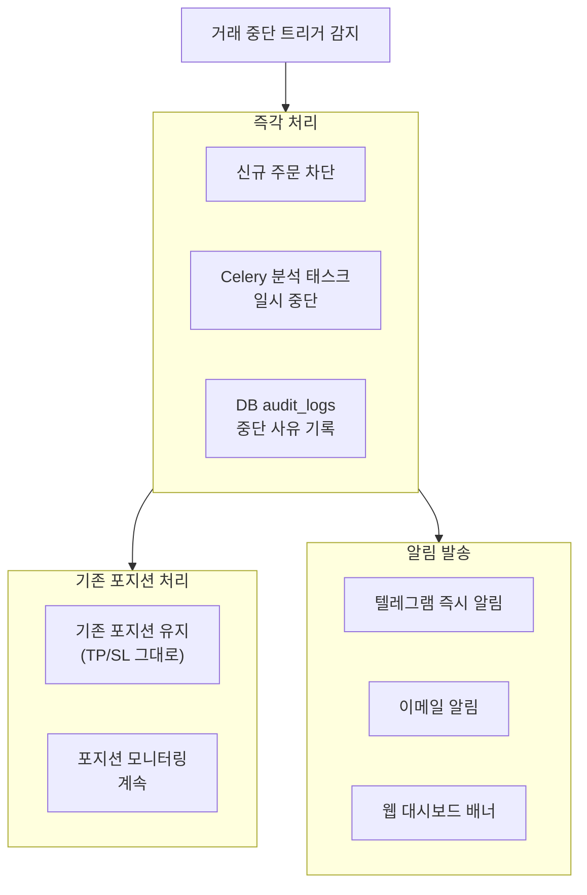
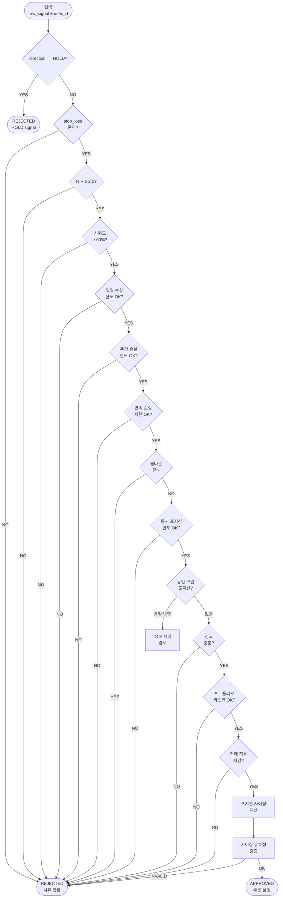

# AI Trading Copilot — Trading Rules

> 작성일: 2026-06-04
> 버전: v1.0
> 참조: CLAUDE.md, AGENTS.md, DATABASE.md, PRD.md
> 용도: Risk Agent 구현 기준 문서 (코드와 1:1 대응)

---

## 핵심 원칙

```
1. 손실 한도는 소프트가 아닌 하드 리미트다 — 예외 없음
2. 규칙 충돌 시 더 보수적인 규칙이 이긴다
3. 불확실할 때는 거래하지 않는다
4. 리스크 관리가 수익보다 먼저다
```

---

## 목차

1. [최대 레버리지](#1-최대-레버리지)
2. [최대 포지션 수](#2-최대-포지션-수)
3. [최대 계좌 위험](#3-최대-계좌-위험)
4. [일일 손실 제한](#4-일일-손실-제한)
5. [주간 손실 제한](#5-주간-손실-제한)
6. [연속 손실 제한](#6-연속-손실-제한)
7. [포지션 사이징](#7-포지션-사이징)
8. [DCA 규칙](#8-dca-규칙)
9. [거래 중단 규칙](#9-거래-중단-규칙)
10. [긴급 청산 규칙](#10-긴급-청산-규칙)
11. [Risk Agent 구현 참조](#11-risk-agent-구현-참조)

---

## 1. 최대 레버리지

### 1.1 절대 상한 (시스템 레벨 — 변경 불가)

```python
SYSTEM_MAX_LEVERAGE = 20          # 시스템 절대 상한 (Binance 정책)
ABSOLUTE_MIN_LEVERAGE = 1         # 레버리지 하한
```

### 1.2 플랜별 기본 최대 레버리지

```python
PLAN_MAX_LEVERAGE = {
    "free":  5,    # Free 플랜: 최대 5x
    "pro":  10,    # Pro 플랜: 최대 10x
    "elite": 20,   # Elite 플랜: 최대 20x
}
```

### 1.3 리스크 프로파일별 기본값

```python
RISK_PROFILE_DEFAULT_LEVERAGE = {
    "conservative": 3,   # 안정형: 기본 3x
    "moderate":     5,   # 중립형: 기본 5x
    "aggressive":  10,   # 공격형: 기본 10x
}
```

### 1.4 AI 신뢰도별 추천 레버리지 (ReviewerAgent 출력)

ReviewerAgent `confidence` 0.70 미만은 FinalDecision에서 자동 REJECT된다.
아래 표는 0.70 이상 신뢰도에 대한 레버리지 참고치다.

| 신뢰도 (confidence) | 최대 추천 레버리지 | 근거 |
|-------------------|----------------|------|
| 70% ~ 80% | 5x | 보통 — 표준 레버리지 |
| 80% ~ 90% | 7x | 높음 — 중간 레버리지 |
| 90% ~ 95% | 10x | 매우 높음 |
| 95% 이상 | 15x | 극도로 높음 (시스템 최고 추천) |

```python
def get_ai_recommended_leverage(confidence: float) -> int:
    if confidence < 0.70:  raise ValueError("confidence < 0.70 should not reach here")
    if confidence < 0.80:  return 5
    if confidence < 0.90:  return 7
    if confidence < 0.95:  return 10
    return 15
```

### 1.5 최종 레버리지 결정 공식

```python
def resolve_final_leverage(
    ai_recommended: int,
    user_max: int,
    plan: str,
    risk_profile: str,
) -> int:
    """
    최종 레버리지 = 4가지 상한 중 가장 낮은 값
    """
    return min(
        ai_recommended,                       # AI 추천
        user_max,                             # 사용자 설정 상한
        PLAN_MAX_LEVERAGE[plan],              # 플랜 상한
        SYSTEM_MAX_LEVERAGE,                  # 시스템 절대 상한
    )
```

### 1.6 레버리지 경고 기준

```python
LEVERAGE_WARNING_THRESHOLDS = {
    "conservative": 5,    # 안정형이 5x 초과 시 UI 경고
    "moderate":    10,    # 중립형이 10x 초과 시 UI 경고
    "aggressive":  15,    # 공격형이 15x 초과 시 UI 경고
}
```

---

## 2. 최대 포지션 수

### 2.1 플랜별 동시 최대 포지션

```python
PLAN_MAX_POSITIONS = {
    "free":  1,
    "pro":   5,
    "elite": 20,
}
```

### 2.2 코인별 제한

```python
MAX_POSITIONS_PER_COIN = 1        # 동일 코인에 동시 포지션 1개
                                  # (반대 방향은 기존 포지션 청산 후 신규)
```

### 2.3 포지션 한도 체크 로직

```python
async def check_position_limits(
    user_id: UUID,
    coin: str,
    plan: str,
    user_max: int,
) -> tuple[bool, str]:
    """
    Returns: (can_open: bool, reason: str)
    """
    open_count = await position_repo.count_open(user_id)
    plan_limit = PLAN_MAX_POSITIONS[plan]
    effective_limit = min(user_max, plan_limit)

    if open_count >= effective_limit:
        return False, f"ORDER_002: 최대 포지션 {effective_limit}개 초과 (현재 {open_count}개)"

    same_coin = await position_repo.get_open_by_coin(user_id, coin)
    if same_coin:
        if same_coin.direction == "LONG":
            return False, f"POSITION_CONFLICT: {coin} LONG 포지션 이미 존재 (ID: {same_coin.id})"
        else:
            return False, f"POSITION_CONFLICT: {coin} SHORT 포지션 이미 존재 (ID: {same_coin.id})"

    return True, "OK"
```

### 2.4 포트폴리오 집중 제한 (Post-MVP)

```python
# 단일 코인에 전체 오픈 포지션의 50% 이상 집중 금지
MAX_SINGLE_COIN_PORTFOLIO_RATIO = 0.50
```

---

## 3. 최대 계좌 위험

### 3.1 거래당 리스크 (Risk Per Trade)

```python
# 사용자 설정 가능 범위
RISK_PER_TRADE_MIN = 0.005        # 0.5% — 최소값
RISK_PER_TRADE_MAX = 0.05         # 5.0% — 최대값

# 리스크 프로파일별 기본값
RISK_PROFILE_DEFAULT_RISK = {
    "conservative": 0.01,         # 1% — 안정형
    "moderate":     0.02,         # 2% — 중립형
    "aggressive":   0.03,         # 3% — 공격형
}
```

> **risk_per_trade의 의미:**
> 계좌 잔고의 N%를 이번 거래에서 최대 손실로 허용한다.
> 예) 잔고 $10,000 × 2% = 최대 손실 $200

### 3.2 포트폴리오 총 리스크 한도

```python
# 오픈 포지션 전체의 예상 최대 손실 합계
MAX_PORTFOLIO_RISK = 0.10         # 계좌의 10% (오픈 포지션 전체)
MAX_PORTFOLIO_RISK_AGGRESSIVE = 0.15  # 공격형: 15%
```

```python
async def check_portfolio_risk(
    user_id: UUID,
    new_trade_risk_usdt: float,
    risk_profile: str,
) -> tuple[bool, str]:
    """현재 오픈 포지션의 총 위험 + 신규 위험이 한도 초과인지 확인"""
    balance = await get_account_balance(user_id)
    current_open_risk = await calculate_open_positions_risk(user_id)
    total_risk = current_open_risk + new_trade_risk_usdt

    limit = MAX_PORTFOLIO_RISK_AGGRESSIVE if risk_profile == "aggressive" else MAX_PORTFOLIO_RISK
    max_risk_usdt = balance * limit

    if total_risk > max_risk_usdt:
        return False, (
            f"PORTFOLIO_RISK: 포트폴리오 총 위험 ${total_risk:.2f}가 "
            f"한도 ${max_risk_usdt:.2f} ({limit:.0%}) 초과"
        )
    return True, "OK"
```

### 3.3 단일 포지션 최대 증거금 제한

```python
# 계좌 잔고 대비 단일 포지션 최대 증거금 비율
MAX_SINGLE_POSITION_MARGIN_RATIO = 0.20   # 잔고의 20%
```

```python
def check_margin_limit(
    margin_required: float,
    balance: float,
) -> tuple[bool, str]:
    if margin_required > balance * MAX_SINGLE_POSITION_MARGIN_RATIO:
        return False, (
            f"MARGIN_LIMIT: 증거금 ${margin_required:.2f}가 "
            f"계좌의 {MAX_SINGLE_POSITION_MARGIN_RATIO:.0%} 초과"
        )
    return True, "OK"
```

---

## 4. 일일 손실 제한

### 4.1 기본값 (사용자 설정 가능)

```python
DAILY_LOSS_LIMIT_DEFAULTS = {
    "conservative": 0.02,         # 2% — 안정형
    "moderate":     0.03,         # 3% — 중립형
    "aggressive":   0.05,         # 5% — 공격형
}

DAILY_LOSS_LIMIT_MIN = 0.005      # 최소 0.5%
DAILY_LOSS_LIMIT_MAX = 0.10       # 최대 10%
```

### 4.2 일일 손실 계산 기준

```python
# 기준: 당일 00:00 UTC 기준 잔고
# 계산: 당일 확정 손실 합계 (수수료 포함, 미실현 PnL 제외)
# 리셋: 매일 00:00 UTC

DAILY_LOSS_RESET_HOUR_UTC = 0     # 자정 UTC (= 09:00 KST)
```

```python
async def get_daily_loss(user_id: UUID) -> float:
    """오늘 UTC 기준 확정 손실 합계 (절댓값)"""
    today_start = datetime.now(tz=timezone.utc).replace(
        hour=0, minute=0, second=0, microsecond=0
    )
    trades_today = await trade_repo.get_by_user_since(user_id, today_start)
    losses = [abs(t.net_pnl) for t in trades_today if t.net_pnl < 0]
    return sum(losses)
```

### 4.3 일일 손실 제한 단계별 처리

```python
DAILY_LOSS_WARNING_PCT  = 0.50    # 한도의 50% 도달 시 경고 알림
DAILY_LOSS_CAUTION_PCT  = 0.80    # 한도의 80% 도달 시 주의 알림
DAILY_LOSS_HALT_PCT     = 1.00    # 한도 100% 도달 시 자동매매 중단

async def check_daily_loss_limit(user_id: UUID, new_loss_usdt: float) -> tuple[bool, str]:
    daily_loss = await get_daily_loss(user_id)
    limit_usdt = await get_daily_loss_limit_usdt(user_id)

    projected = daily_loss + new_loss_usdt

    # 경보 알림 (거래는 허용)
    if daily_loss >= limit_usdt * DAILY_LOSS_WARNING_PCT:
        await send_alert(user_id, "daily_loss_warning", {"current": daily_loss, "limit": limit_usdt})

    if daily_loss >= limit_usdt * DAILY_LOSS_CAUTION_PCT:
        await send_alert(user_id, "daily_loss_caution", {"current": daily_loss, "limit": limit_usdt})

    # 거래 차단
    if daily_loss >= limit_usdt * DAILY_LOSS_HALT_PCT:
        await disable_auto_trading(user_id, reason="DAILY_LOSS_LIMIT", until="midnight_utc")
        return False, f"ORDER_001: 일일 손실 한도 도달 (${daily_loss:.2f} / ${limit_usdt:.2f})"

    # 이 거래 실행 시 한도 초과 예측
    if projected > limit_usdt:
        return False, (
            f"ORDER_001: 이 거래 실행 시 일일 손실 한도 초과 예상 "
            f"(현재 ${daily_loss:.2f} + 예상 손실 ${new_loss_usdt:.2f} > 한도 ${limit_usdt:.2f})"
        )

    return True, "OK"
```

---

## 5. 주간 손실 제한

### 5.1 기본값

```python
WEEKLY_LOSS_LIMIT_DEFAULTS = {
    "conservative": 0.05,         # 5%
    "moderate":     0.10,         # 10%
    "aggressive":   0.15,         # 15%
}

WEEKLY_LOSS_RESET_DAY = 0         # 월요일 00:00 UTC 리셋
```

### 5.2 주간 손실 계산 및 처리

```python
async def check_weekly_loss_limit(user_id: UUID) -> tuple[bool, str]:
    week_start = get_current_week_start_utc()
    trades_this_week = await trade_repo.get_by_user_since(user_id, week_start)

    weekly_loss = sum(abs(t.net_pnl) for t in trades_this_week if t.net_pnl < 0)
    week_start_balance = await get_balance_at(user_id, week_start)
    limit_usdt = week_start_balance * await get_weekly_loss_limit_pct(user_id)

    if weekly_loss >= limit_usdt:
        # 이번 주 자동매매 중단 (월요일 00:00 UTC까지)
        next_monday = get_next_monday_utc()
        await disable_auto_trading(
            user_id,
            reason="WEEKLY_LOSS_LIMIT",
            until=next_monday,
        )
        await send_alert(user_id, "weekly_loss_limit_reached", {
            "weekly_loss": weekly_loss,
            "limit": limit_usdt,
            "resumes_at": next_monday.isoformat(),
        })
        return False, f"WEEKLY_LOSS: 주간 손실 한도 도달 (${weekly_loss:.2f} / ${limit_usdt:.2f})"

    return True, "OK"
```

### 5.3 주간 손실 단계별 알림

| 주간 손실 진행률 | 조치 |
|--------------|------|
| 50% 도달 | 텔레그램 경고 알림 |
| 75% 도달 | 텔레그램 + 이메일 경고 |
| 90% 도달 | 반자동 모드 강제 전환 (확인 필요) |
| 100% 도달 | 자동매매 완전 중단 (주간 리셋까지) |

---

## 6. 연속 손실 제한

### 6.1 기준값

```python
CONSECUTIVE_LOSS_COOLDOWN   = 3   # 3연속 손실 → 30분 쿨다운
CONSECUTIVE_LOSS_HALT       = 5   # 5연속 손실 → 자동매매 중단
COOLDOWN_MINUTES            = 30  # 쿨다운 시간
```

### 6.2 연속 손실 계산 로직

```python
async def get_consecutive_losses(user_id: UUID) -> int:
    """가장 최근 거래부터 역순으로 연속 손실 횟수 계산"""
    recent_trades = await trade_repo.get_recent_by_user(user_id, limit=10)

    count = 0
    for trade in recent_trades:   # 최신순 정렬
        if trade.net_pnl < 0:
            count += 1
        else:
            break                 # 수익 거래 나오면 연속 중단
    return count

async def check_consecutive_losses(user_id: UUID) -> tuple[bool, str]:
    consecutive = await get_consecutive_losses(user_id)

    if consecutive >= CONSECUTIVE_LOSS_HALT:
        await disable_auto_trading(user_id, reason="CONSECUTIVE_LOSSES")
        await send_alert(user_id, "consecutive_loss_halt", {
            "count": consecutive,
            "message": f"{consecutive}연속 손실 — 자동매매 중단. 전략을 점검하세요."
        })
        return False, f"CONSEC_LOSS: {consecutive}연속 손실로 자동매매 중단"

    if consecutive >= CONSECUTIVE_LOSS_COOLDOWN:
        cooldown_until = datetime.now(tz=timezone.utc) + timedelta(minutes=COOLDOWN_MINUTES)
        await set_trading_cooldown(user_id, cooldown_until)
        await send_alert(user_id, "consecutive_loss_cooldown", {
            "count": consecutive,
            "resumes_at": cooldown_until.isoformat(),
        })
        return False, f"CONSEC_LOSS: {consecutive}연속 손실 — {COOLDOWN_MINUTES}분 쿨다운"

    return True, "OK"
```

### 6.3 연속 손실 해제 조건

```python
# 자동 해제: 쿨다운 시간 경과 후 자동 복구
# 수동 해제: 사용자가 대시보드에서 명시적으로 재활성화
# 알림: 쿨다운 종료 5분 전 텔레그램 알림

CONSECUTIVE_LOSS_AUTO_RESUME = True   # 쿨다운은 자동 해제
HALT_REQUIRES_MANUAL_RESUME  = True   # 5연속 손실 후는 수동 재활성화 필요
```

---

## 7. 포지션 사이징

### 7.1 핵심 공식

```python
def calculate_position_size(
    account_balance: float,     # 사용 가능 잔고 (USDT)
    risk_per_trade: float,      # 거래당 리스크 비율 (예: 0.02 = 2%)
    entry_price: float,         # 진입가
    stop_loss_price: float,     # 손절가
    leverage: int,              # 최종 레버리지
) -> PositionSizingResult:
    """
    핵심 공식:
      sl_distance     = |entry_price - stop_loss_price|
      risk_amount     = account_balance × risk_per_trade
      position_size   = risk_amount / sl_distance    ← 달러 기준 포지션
      quantity        = (position_size × leverage) / entry_price

    예시:
      balance=$10,000, risk=2%, entry=$67,450, sl=$66,800, leverage=5x
      → sl_distance   = $650
      → risk_amount   = $200
      → position_size = $200 / $650 = $307.69 (증거금)
      → quantity      = ($307.69 × 5) / $67,450 = 0.02282 BTC
    """
    sl_distance   = abs(entry_price - stop_loss_price)
    risk_amount   = account_balance * risk_per_trade
    position_size = risk_amount / sl_distance           # 증거금 (USDT)
    quantity      = (position_size * leverage) / entry_price

    max_loss    = risk_amount
    margin_used = position_size

    return PositionSizingResult(
        quantity      = round_to_lot_size(quantity),
        margin_used   = round(margin_used, 2),
        position_value= round(position_size * leverage, 2),
        max_loss      = round(max_loss, 2),
        max_profit    = round(max_loss * signal_rr_ratio, 2),
    )
```

### 7.2 수량 반올림 (Binance Lot Size)

```python
BINANCE_LOT_SIZES = {
    "BTCUSDT":  0.001,    # 최소 0.001 BTC
    "ETHUSDT":  0.01,     # 최소 0.01 ETH
    "DEFAULT":  0.001,
}

BINANCE_MIN_NOTIONAL = {
    "BTCUSDT":  5.0,      # 최소 주문 금액 $5
    "ETHUSDT":  5.0,
    "DEFAULT":  5.0,
}

def round_to_lot_size(quantity: float, symbol: str) -> float:
    lot = BINANCE_LOT_SIZES.get(symbol, BINANCE_LOT_SIZES["DEFAULT"])
    return math.floor(quantity / lot) * lot   # 항상 내림 (초과 거래 방지)
```

### 7.3 포지션 사이징 유효성 검증

```python
def validate_position_size(
    result: PositionSizingResult,
    balance: float,
    entry_price: float,
    symbol: str,
) -> tuple[bool, str]:

    # 최소 수량 체크
    min_qty = BINANCE_LOT_SIZES.get(symbol, 0.001)
    if result.quantity < min_qty:
        return False, f"SIZING: 계산된 수량 {result.quantity}가 최소 주문량 {min_qty} 미만"

    # 최소 주문 금액 체크
    notional = result.quantity * entry_price
    min_notional = BINANCE_MIN_NOTIONAL.get(symbol, 5.0)
    if notional < min_notional:
        return False, f"SIZING: 주문 금액 ${notional:.2f}가 최소 ${min_notional} 미만"

    # 단일 포지션 증거금 한도 체크
    if result.margin_used > balance * MAX_SINGLE_POSITION_MARGIN_RATIO:
        return False, (
            f"SIZING: 증거금 ${result.margin_used:.2f}가 "
            f"잔고 {MAX_SINGLE_POSITION_MARGIN_RATIO:.0%} 한도 초과"
        )

    # 잔고 충분성 체크 (10% 버퍼 포함)
    required_with_buffer = result.margin_used * 1.10
    if required_with_buffer > balance:
        return False, (
            f"SIZING: 필요 증거금 ${required_with_buffer:.2f} "
            f"(버퍼 포함) > 잔고 ${balance:.2f}"
        )

    return True, "OK"
```

### 7.4 R:R 비율 강제

```python
MIN_RR_RATIO = 2.0                # 최소 리스크:리워드 = 1:2

def validate_rr_ratio(
    entry: float,
    take_profit: float,
    stop_loss: float,
    direction: str,
) -> tuple[bool, float, str]:
    if direction == "LONG":
        profit_distance = take_profit - entry
        loss_distance   = entry - stop_loss
    else:  # SHORT
        profit_distance = entry - take_profit
        loss_distance   = stop_loss - entry

    if loss_distance <= 0:
        return False, 0.0, "RR_RATIO: 손절가가 진입가보다 불리한 방향"

    rr_ratio = profit_distance / loss_distance

    if rr_ratio < MIN_RR_RATIO:
        return False, rr_ratio, (
            f"ORDER_004: R:R {rr_ratio:.2f} < 최소 {MIN_RR_RATIO} "
            f"(목표: ${take_profit:,.2f}, 손절: ${stop_loss:,.2f})"
        )

    return True, rr_ratio, "OK"
```

---

## 8. DCA 규칙

> DCA (Dollar Cost Averaging): 기존 포지션과 동일 방향으로 추가 진입

### 8.1 DCA 기본 정책

```python
DCA_ENABLED         = True        # DCA 기능 활성화 여부 (시스템 레벨)
MAX_DCA_COUNT       = 2           # 동일 포지션에 최대 DCA 횟수
DCA_RISK_MULTIPLIER = 2.0         # DCA 후 총 리스크는 원래의 2배 이하
DCA_MIN_PRICE_MOVE  = 1.0         # DCA 진입을 위한 최소 가격 이동 (ATR 배수)
```

### 8.2 DCA 허용 조건 (모두 충족 시에만)

```python
async def check_dca_eligibility(
    existing_position: Position,
    new_signal: ApprovedSignal,
    account: AccountState,
) -> tuple[bool, str]:

    # 조건 1: 동일 방향 확인
    if existing_position.direction != new_signal.direction:
        return False, "DCA_DIRECTION: 반대 방향 — DCA 불가"

    # 조건 2: DCA 횟수 한도
    current_dca_count = await order_repo.count_dca_orders(existing_position.id)
    if current_dca_count >= MAX_DCA_COUNT:
        return False, f"DCA_LIMIT: 최대 DCA {MAX_DCA_COUNT}회 초과"

    # 조건 3: 가격 이동 충분성 (충동 DCA 방지)
    atr = await get_current_atr(existing_position.symbol, "1h")
    price_move = abs(new_signal.entry_price - existing_position.entry_price)
    if price_move < atr * DCA_MIN_PRICE_MOVE:
        return False, (
            f"DCA_PREMATURE: 가격 이동 ${price_move:.2f} < "
            f"ATR 기준 ${atr * DCA_MIN_PRICE_MOVE:.2f}"
        )

    # 조건 4: DCA 후 총 리스크 한도
    existing_risk = calculate_position_risk(existing_position)
    new_risk      = new_signal.max_loss_usdt
    total_risk    = existing_risk + new_risk
    original_risk = existing_position.original_risk_usdt

    if total_risk > original_risk * DCA_RISK_MULTIPLIER:
        return False, (
            f"DCA_RISK: DCA 후 총 리스크 ${total_risk:.2f}가 "
            f"원래 리스크의 {DCA_RISK_MULTIPLIER}배 초과"
        )

    # 조건 5: 일일/주간 손실 한도 여유 확인
    ok, reason = await check_daily_loss_limit(account.user_id, new_risk)
    if not ok:
        return False, f"DCA_LIMIT: {reason}"

    return True, "OK"
```

### 8.3 DCA 후 평균 진입가 재계산

```python
def recalculate_avg_entry(
    original_qty:   float,
    original_entry: float,
    dca_qty:        float,
    dca_entry:      float,
) -> float:
    """가중평균 진입가 계산"""
    total_qty   = original_qty + dca_qty
    total_value = (original_qty * original_entry) + (dca_qty * dca_entry)
    return total_value / total_qty
```

### 8.4 DCA 금지 조건

```python
DCA_FORBIDDEN_CONDITIONS = [
    "daily_loss_limit_warning",   # 일일 손실 경고(50%) 이상 발생 시
    "consecutive_loss_cooldown",  # 연속 손실 쿨다운 중
    "weekly_loss_limit_warning",  # 주간 손실 경고(75%) 이상 발생 시
    "position_in_drawdown_over_5pct",  # 포지션 손실이 5% 이상일 때
]
```

---

## 9. 거래 중단 규칙

### 9.1 자동 중단 트리거 (Auto-Halt)

```python
class HaltTrigger(str, Enum):
    DAILY_LOSS_LIMIT    = "DAILY_LOSS_LIMIT"    # 일일 손실 한도
    WEEKLY_LOSS_LIMIT   = "WEEKLY_LOSS_LIMIT"   # 주간 손실 한도
    CONSECUTIVE_LOSSES  = "CONSECUTIVE_LOSSES"  # 5연속 손실
    API_FAILURES        = "API_FAILURES"        # API 3회 연속 실패
    LIQUIDATION_EVENT   = "LIQUIDATION_EVENT"   # 강제청산 발생
    SYSTEM_ERROR        = "SYSTEM_ERROR"        # 시스템 오류

HALT_DURATION = {
    HaltTrigger.DAILY_LOSS_LIMIT:   "midnight_utc",       # 당일 자정까지
    HaltTrigger.WEEKLY_LOSS_LIMIT:  "next_monday_utc",    # 다음 월요일까지
    HaltTrigger.CONSECUTIVE_LOSSES: "manual_resume",      # 수동 재활성화
    HaltTrigger.API_FAILURES:       "30_minutes",         # 30분
    HaltTrigger.LIQUIDATION_EVENT:  "manual_resume",      # 수동 재활성화
    HaltTrigger.SYSTEM_ERROR:       "manual_resume",      # 수동 재활성화
}
```

### 9.2 거래 중단 처리 흐름



### 9.3 거래 중단 시 기존 포지션 처리 원칙

```python
# 거래 중단 = 신규 진입만 차단
# 기존 오픈 포지션은 TP/SL 설정 유지하며 정상 운영
# 단, LIQUIDATION_EVENT 발생 시는 전체 포지션 검토 필요

HALT_CLOSES_EXISTING = {
    HaltTrigger.DAILY_LOSS_LIMIT:   False,   # 기존 포지션 유지
    HaltTrigger.WEEKLY_LOSS_LIMIT:  False,   # 기존 포지션 유지
    HaltTrigger.CONSECUTIVE_LOSSES: False,   # 기존 포지션 유지
    HaltTrigger.API_FAILURES:       False,   # 유지 (모니터링은 REST 폴백)
    HaltTrigger.LIQUIDATION_EVENT:  True,    # 전체 청산 권고
    HaltTrigger.SYSTEM_ERROR:       True,    # 전체 청산 권고
}
```

### 9.4 수동 재활성화 조건

```python
MANUAL_RESUME_CHECKLIST = """
자동매매 재활성화 전 확인 사항:
1. 중단 사유를 이해했는가?
2. 일일/주간 손실 한도를 재설정했는가?
3. 전략이 여전히 유효한가?
4. 마켓 컨디션이 거래에 적합한가?
"""
# 사용자가 체크리스트를 확인(클릭)해야만 재활성화 가능
REQUIRE_RESUME_CHECKLIST = True
```

---

## 10. 긴급 청산 규칙

### 10.1 자동 긴급 청산 트리거

```python
class EmergencyCloseLevel(str, Enum):
    WARNING  = "warning"    # 경보만 (청산 안 함)
    PARTIAL  = "partial"    # 50% 부분 청산
    FULL     = "full"       # 100% 전량 청산

LIQUIDATION_DISTANCE_THRESHOLDS = {
    0.10: EmergencyCloseLevel.WARNING,   # 청산가까지 10% 이내
    0.05: EmergencyCloseLevel.WARNING,   # 청산가까지 5% 이내 (반복 경보)
    0.03: EmergencyCloseLevel.PARTIAL,   # 청산가까지 3% 이내 → 50% 자동 청산
    0.02: EmergencyCloseLevel.FULL,      # 청산가까지 2% 이내 → 100% 강제 청산
}
```

### 10.2 청산 거리 계산

```python
def calculate_liquidation_distance(position: Position, current_price: float) -> float:
    """
    현재가에서 강제청산까지의 거리 비율
    LONG: (current_price - liquidation_price) / current_price
    SHORT: (liquidation_price - current_price) / current_price
    """
    if position.direction == "LONG":
        return (current_price - position.liquidation_price) / current_price
    else:
        return (position.liquidation_price - current_price) / current_price

async def monitor_liquidation_risk(position: Position, current_price: float):
    distance = calculate_liquidation_distance(position, current_price)

    for threshold, level in sorted(LIQUIDATION_DISTANCE_THRESHOLDS.items()):
        if distance <= threshold:
            if level == EmergencyCloseLevel.WARNING:
                await send_liquidation_warning(position, distance)

            elif level == EmergencyCloseLevel.PARTIAL:
                await emergency_close_partial(position, ratio=0.50)
                await send_alert(position.user_id, "emergency_partial_close", {
                    "reason": f"청산가까지 {distance:.1%}",
                    "closed_pct": 50,
                })

            elif level == EmergencyCloseLevel.FULL:
                await emergency_close_full(position)
                await send_alert(position.user_id, "emergency_full_close", {
                    "reason": f"청산가까지 {distance:.1%} — 강제 전량 청산",
                })
            break
```

### 10.3 텔레그램 명령 긴급 청산

```python
# /closeall 명령 처리
CLOSEALL_CONFIRMATION_KEYWORD = "CLOSE_ALL"   # 오타 방지 이중 확인
CLOSEALL_TIMEOUT_SECONDS = 10                 # 명령 수신 후 10초 내 완료

async def handle_closeall_command(user_id: UUID, confirmation: str):
    """
    /closeall 수신 → 이중 확인 → 전체 포지션 시장가 청산
    완료 시간 목표: 10초 이내
    """
    if confirmation != CLOSEALL_CONFIRMATION_KEYWORD:
        await bot.send(user_id, "확인 키워드를 입력하세요: CLOSE_ALL")
        return

    positions = await position_repo.get_all_open(user_id)
    if not positions:
        await bot.send(user_id, "오픈 포지션이 없습니다.")
        return

    results = await asyncio.gather(
        *[emergency_close_full(pos) for pos in positions],
        return_exceptions=True
    )

    success = [r for r in results if not isinstance(r, Exception)]
    failed  = [r for r in results if isinstance(r, Exception)]

    await bot.send(user_id, (
        f"긴급 청산 완료\n"
        f"성공: {len(success)}건 / 실패: {len(failed)}건\n"
        f"총 실현 PnL: ${sum(r.realized_pnl for r in success):+.2f}"
    ))

    await audit_log(user_id, "emergency_closeall", {
        "positions_closed": len(success),
        "trigger": "telegram_command"
    })
```

### 10.4 계좌 잔고 임계값 긴급 청산

```python
ACCOUNT_BALANCE_EMERGENCY_THRESHOLD = 0.10   # 초기 잔고의 10% 미만 시

async def check_account_balance_emergency(user_id: UUID):
    """잔고가 초기값의 10% 미만이면 전체 청산"""
    current_balance = await get_account_balance(user_id)
    initial_balance = await get_initial_balance(user_id)  # 가입 시 첫 잔고

    if current_balance < initial_balance * ACCOUNT_BALANCE_EMERGENCY_THRESHOLD:
        positions = await position_repo.get_all_open(user_id)
        if positions:
            await handle_closeall_command(user_id, CLOSEALL_CONFIRMATION_KEYWORD)
            await disable_auto_trading(user_id, reason="LOW_BALANCE_EMERGENCY")
            await send_alert(user_id, "low_balance_emergency", {
                "current": current_balance,
                "threshold": initial_balance * ACCOUNT_BALANCE_EMERGENCY_THRESHOLD,
            })
```

### 10.5 긴급 청산 완료 처리

```python
async def emergency_close_full(position: Position) -> ClosedPosition:
    """전량 시장가 청산 — 슬리피지 감수, 속도 우선"""
    order = await binance_client.place_order(
        symbol    = position.symbol,
        side      = "SELL" if position.direction == "LONG" else "BUY",
        type      = "MARKET",
        quantity  = position.quantity,
        reduce_only = True,
    )
    # TP/SL 기존 주문 취소
    await binance_client.cancel_all_orders(position.symbol)

    # DB 업데이트
    closed = await position_repo.close(
        position_id  = position.id,
        close_price  = order.avg_fill_price,
        close_reason = "emergency",
    )

    # 거래일지 트리거 (Journal Agent)
    await redis_streams.publish("stream:journal", {
        "event_type":  "generate_journal",
        "position_id": str(position.id),
        "user_id":     str(position.user_id),
        "close_reason": "emergency",
    })

    return closed
```

---

## 11. Risk Agent 구현 참조

### 11.1 전체 검증 파이프라인 (순서 엄수)



### 11.2 Risk Agent 완전 구현 참조 코드

```python
# agents/risk_manager.py

@dataclass
class ValidationResult:
    approved: bool
    rejection_reason: Optional[str] = None
    quantity: Optional[float] = None
    final_leverage: Optional[int] = None
    margin_required_usdt: Optional[float] = None
    max_loss_usdt: Optional[float] = None
    max_profit_usdt: Optional[float] = None
    pre_action: Optional[str] = None    # "close_existing" | "dca"
    existing_position_id: Optional[UUID] = None


async def run_risk_validation(
    signal: RawSignal,
    user_id: UUID,
    exchange_account_id: UUID,
) -> ValidationResult:
    """
    Risk Agent 메인 엔트리포인트
    실패 기본값: 거부 (안전 우선)
    DB/Redis 조회 실패 시: 보수적으로 거부
    """
    try:
        user     = await user_repo.get_with_settings(user_id)
        account  = await get_account_state(user_id, exchange_account_id)

        # ── CHECK 0: HOLD 시그널 ────────────────────────────
        if signal.direction == "HOLD":
            return ValidationResult(approved=False, rejection_reason="HOLD")

        # ── CHECK 1: 손절 존재 ──────────────────────────────
        if signal.stop_loss is None:
            raise SystemError("stop_loss is None — invariant violated")

        # ── CHECK 2: R:R 비율 ───────────────────────────────
        ok, rr, reason = validate_rr_ratio(
            signal.entry_price, signal.take_profit,
            signal.stop_loss,   signal.direction
        )
        if not ok:
            return ValidationResult(approved=False, rejection_reason=reason)

        # ── CHECK 3: 신뢰도 ─────────────────────────────────
        # 현행 파이프라인: AI confidence 검사는 RiskEngine이 아닌 FinalDecision에서 수행.
        # 임계값 MIN_AI_REVIEW_CONFIDENCE = 0.70 (agents/decision/constants.py).
        # ReviewerAgent가 0.70 미만 confidence를 반환하면 FinalDecision이 HOLD 처리한다.
        if signal.confidence < 0.70:
            return ValidationResult(
                approved=False,
                rejection_reason=f"LOW_CONFIDENCE: {signal.confidence:.0%} < 70%"
            )

        # ── CHECK 4: 일일 손실 한도 ─────────────────────────
        ok, reason = await check_daily_loss_limit(user_id, signal.risk_usdt)
        if not ok:
            return ValidationResult(approved=False, rejection_reason=reason)

        # ── CHECK 5: 주간 손실 한도 ─────────────────────────
        ok, reason = await check_weekly_loss_limit(user_id)
        if not ok:
            return ValidationResult(approved=False, rejection_reason=reason)

        # ── CHECK 6: 연속 손실 ──────────────────────────────
        ok, reason = await check_consecutive_losses(user_id)
        if not ok:
            return ValidationResult(approved=False, rejection_reason=reason)

        # ── CHECK 7: 쿨다운 중 ──────────────────────────────
        if await is_in_cooldown(user_id):
            cooldown_end = await get_cooldown_end(user_id)
            return ValidationResult(
                approved=False,
                rejection_reason=f"COOLDOWN: {cooldown_end.isoformat()} 까지"
            )

        # ── CHECK 8: 동시 포지션 한도 ───────────────────────
        ok, reason = await check_position_limits(
            user_id, signal.coin, user.plan, user.settings.max_concurrent_positions
        )
        if not ok:
            # 동일 코인 기존 포지션 처리
            existing = await position_repo.get_open_by_coin(user_id, signal.coin)
            if existing and existing.direction == signal.direction:
                # 동일 방향: DCA 경로
                ok, reason = await check_dca_eligibility(existing, signal, account)
                if ok:
                    pass  # DCA 진행
                else:
                    return ValidationResult(approved=False, rejection_reason=reason)
            elif existing:
                # 반대 방향: 기존 청산 후 신규
                return ValidationResult(
                    approved=True,
                    pre_action="close_existing",
                    existing_position_id=existing.id,
                    rejection_reason=None,
                )
            else:
                return ValidationResult(approved=False, rejection_reason=reason)

        # ── CHECK 9: 잔고 충분성 ─────────────────────────────
        sizing = calculate_position_size(
            account_balance  = account.available_balance,
            risk_per_trade   = user.settings.risk_per_trade,
            entry_price      = signal.entry_price,
            stop_loss_price  = signal.stop_loss,
            leverage         = resolve_final_leverage(
                signal.leverage,
                user.settings.max_leverage,
                user.plan,
                user.risk_profile,
            ),
        )
        ok, reason = validate_position_size(
            sizing, account.available_balance, signal.entry_price, signal.symbol
        )
        if not ok:
            return ValidationResult(approved=False, rejection_reason=reason)

        # ── CHECK 10: 포트폴리오 총 리스크 ──────────────────
        ok, reason = await check_portfolio_risk(
            user_id, sizing.max_loss, user.risk_profile
        )
        if not ok:
            return ValidationResult(approved=False, rejection_reason=reason)

        # ── CHECK 11: 거래 허용 시간 ─────────────────────────
        if not is_within_allowed_hours(user.settings.allowed_hours):
            return ValidationResult(
                approved=False,
                rejection_reason="TIME_RESTRICTION: 설정된 거래 허용 시간 외"
            )

        # ── 모든 검증 통과 ───────────────────────────────────
        final_leverage = resolve_final_leverage(
            signal.leverage,
            user.settings.max_leverage,
            user.plan,
            user.risk_profile,
        )

        return ValidationResult(
            approved             = True,
            quantity             = sizing.quantity,
            final_leverage       = final_leverage,
            margin_required_usdt = sizing.margin_used,
            max_loss_usdt        = sizing.max_loss,
            max_profit_usdt      = sizing.max_profit,
        )

    except Exception as e:
        # 예외 발생 시 항상 거부 (안전 우선)
        logger.error("risk_validation_error", error=str(e), user_id=str(user_id))
        return ValidationResult(
            approved=False,
            rejection_reason=f"SYSTEM_ERROR: {type(e).__name__}"
        )
```

### 11.3 규칙 상수 전체 요약

```python
# agents/risk_constants.py
# Risk Agent가 임포트하는 단일 상수 파일

# ── 레버리지 ──────────────────────────────────────
SYSTEM_MAX_LEVERAGE              = 20
PLAN_MAX_LEVERAGE                = {"free": 5, "pro": 10, "elite": 20}
RISK_PROFILE_DEFAULT_LEVERAGE    = {"conservative": 3, "moderate": 5, "aggressive": 10}

# ── 포지션 수 ─────────────────────────────────────
PLAN_MAX_POSITIONS               = {"free": 1, "pro": 5, "elite": 20}
MAX_POSITIONS_PER_COIN           = 1

# ── 계좌 위험 ─────────────────────────────────────
RISK_PER_TRADE_MIN               = 0.005    # 0.5%
RISK_PER_TRADE_MAX               = 0.050    # 5.0%
MAX_PORTFOLIO_RISK               = 0.10     # 10%
MAX_PORTFOLIO_RISK_AGGRESSIVE    = 0.15     # 15%
MAX_SINGLE_POSITION_MARGIN_RATIO = 0.20     # 20%

# ── 일일 손실 ─────────────────────────────────────
DAILY_LOSS_LIMIT_MIN             = 0.005    # 0.5%
DAILY_LOSS_LIMIT_MAX             = 0.100    # 10.0%
DAILY_LOSS_WARNING_PCT           = 0.50
DAILY_LOSS_CAUTION_PCT           = 0.80
DAILY_LOSS_HALT_PCT              = 1.00

# ── 주간 손실 ─────────────────────────────────────
WEEKLY_LOSS_LIMIT_DEFAULTS       = {"conservative": 0.05, "moderate": 0.10, "aggressive": 0.15}

# ── 연속 손실 ─────────────────────────────────────
CONSECUTIVE_LOSS_COOLDOWN        = 3        # 3연속 → 30분 쿨다운
CONSECUTIVE_LOSS_HALT            = 5        # 5연속 → 자동매매 중단
COOLDOWN_MINUTES                 = 30

# ── 포지션 사이징 ─────────────────────────────────
MIN_RR_RATIO                     = 2.0
MIN_AI_REVIEW_CONFIDENCE         = 0.70   # agents/decision/constants.py
BINANCE_LOT_SIZES                = {"BTCUSDT": 0.001, "ETHUSDT": 0.01}
BINANCE_MIN_NOTIONAL             = {"BTCUSDT": 5.0, "ETHUSDT": 5.0}

# ── DCA ───────────────────────────────────────────
MAX_DCA_COUNT                    = 2
DCA_RISK_MULTIPLIER              = 2.0
DCA_MIN_PRICE_MOVE_ATR           = 1.0

# ── 긴급 청산 ─────────────────────────────────────
LIQ_DISTANCE_WARNING             = 0.10     # 10%
LIQ_DISTANCE_PARTIAL             = 0.03     # 3% → 50% 청산
LIQ_DISTANCE_FULL                = 0.02     # 2% → 100% 청산
PARTIAL_CLOSE_RATIO              = 0.50     # 50%
ACCOUNT_EMERGENCY_THRESHOLD      = 0.10     # 초기 잔고의 10%
CLOSEALL_TIMEOUT_SECONDS         = 10
CLOSEALL_CONFIRMATION_KEYWORD    = "CLOSE_ALL"
```

---

> **이 문서의 모든 규칙은 Risk Agent 코드와 1:1 대응된다.**
> 규칙 변경 시 반드시 이 문서와 코드를 동시에 업데이트한다.
> 어떤 규칙도 개별 사용자 요청으로 우회할 수 없다.
> Safety First 원칙은 이 문서의 모든 규칙에 우선한다.
